# Plataforma de Datos Empresarial: Pipeline E2E, ETL Vectorizado, Orquestación Airflow, DW Dimensional y BI
Buenas a todos, bienvenido a otro proyecto más de ingeniería de datos, esta vez enfocado a una solución empresarial diseñada para transformar la gestión de información corporativa mediante un sistema completo de procesamiento y análisis de datos.      
Diseñaré y implementaré una solución end-to-end (E2E) que aborde desde la captura inicial de los datos hasta su presentación final, garantizando calidad, linaje, confiabilidad y accesibilidad en todo el proceso.    
Se utilizarán distintas estrategias y tecnologías modernas para llevar a cabo esta premisa.   

> [!IMPORTANT]   
> Este proyecto esta enfocado para organizaciones que enfrentan desafíos críticos en la gestión integral de datos empresariales, donde la información proveniente de múltiples fuentes operativas converge sin una estrategia unificada.    
> Estas empresas sufren de consecuencias directas como reporting inconsistente entre áreas, procesos ETL manuales que consumen días de procesamiento y son propensos a errores, falta de visibilidad unificada del negocio para la toma de decisiones estratégicas, y arquitecturas frágiles sin automatización que imposibilitan la escalabilidad.     
> La incapacidad para transformar datos crudos distribuidos en inteligencia accionable impacta directamente en la ventaja competitiva y eficiencia operacional, generando pérdidas financieras por decisiones basadas en información desactualizada o incompleta.

El objetivo es el desarrollo de un ecosistema de datos robusto para una organización con múltiples puntos de operación, donde la información proveniente de ventas, compras, proveedores, empleados y gastos converge hacia un modelo analítico unificado.    
Se movilizarán todos los datos empresariales hacia un esquema optimizado que facilite la toma de decisiones estratégicas y aumente el valor del negocio mediante insights.   

El sistema será construido bajo principios de modularidad y escalabilidad, donde cada etapa del proceso mantiene su independencia funcional mientras colabora con las demás.    
La ingestión de datos se realizará desde múltiples fuentes, seguida de procesos de validación y transformación que aseguran la integridad de la información antes de su almacenamiento definitivo.   
Todo el proceso será guiado a través de un orquestador para gestionar los flujos, a través de implementación de buenos principios y patrones de diseños.   

Se diseñará una capa de almacenamiento a través de un modelo dimensional para optimizar las consultas y el análisis.  
La idea es que los datos adquieran una estructura que potencie la exploración y el descubrimiento de patrones empresariales, respaldado por mecanismos que preservan el historial de cambios y faciliten la auditoría.

Por último, se implementará una capa de visualización que permitirá que los datos procesados sean transformados en representaciones intuitivas que permitan a las partes interesadas (o stakeholders) comprender rápidamente el estado del negocio, identificar las oportunidades y monitorear indicadores clave de desempeño.

Como en todos mis proyectos el ciclo de vida del mismo es automatizado y gestionado a través de un gestor, permitiendo a los usuarios interactuar con el ecosistema completo sin requerir conocimientos técnicos especializados.    
Cada componente del sistema será creado considerando requisitos de confiabilidad, trazabilidad y flexibilidad.      
Toda la realización de este proyecto esta documentado, desde tomas de decisiones arquitectónicas y tecnológicas, scripts, componentes, etc.     

Al final de este proyecto encontrará una solución de nivel empresarial que puede ser extrapolada fácilmente a los desafíos de una empresa real.   

Para profundizar en el contexto empresarial específico y los desafíos técnicos que motivaron este desarrollo, puede consultar la sección de [**Descripción del Proyecto**](#descripción-del-proyecto), donde se presenta un análisis detallado del caso de estudio que fundamenta esta implementación.

> [!IMPORTANT]    
> GitHub presenta limitaciones en la carga de imágenes en READMEs.       
> Esto hace que no se puedan visualizar todas las fotos del proyecto, que son un complemento importante para explicar y desarrollar el mismo.        
> Mi solución fue cargarlas a un servicio de hosting externo y utilizar las URLs para incrustarlas en el README.     
> Esto hace que las imágenes funcionen en su mayoría pero hay algunos pocos casos donde se visualiza con pequeñas porciones de fondos blancos.       
> Para esos casos, puede abrir la imagen en una nueva pestaña.    
> Se deja un link en la parte inferior o superior de la imagen bajo la leyenda "Link Imagen".    
> En el caso que se borraran las imágenes desde el host puede buscar su versión análoga en la carpeta de imágenes/images.
> Véra que la parte final de la URL tiene definido el mismo nombre en la carpeta en cuestión.
>
> Mi recomendación es descargar el proyecto y visualizar el README usando una función de previsualización, por ejemplo en Visual Studio Code puede utilizar CTRL+SHIFT+V o su correspondiente combinación definida, de esta forma podrá visualizar todo el contenido y probar el proyecto.
>   
> Encontrará que en el README tendrá dos versiones de carga de imágenes:        
> - Una comentada que hace referencia a la versión en ./images.     
> - La utilizada que hace referencia a la URL externa de la imagen.         
>     
> Puede utilizar la versión local en caso que la segunda opción falle o no tenga internet.


## **Tabla De Contenidos**
- [**Vista Rápida Datasets**](#vista-rápida-datasets)
- [**Fundamentos Del Proyecto**](#fundamentos)
   - [**Descripción Del Proyecto**](#descripción-del-proyecto)
   - [**Objetivos**](#objetivos)
   - [**Requerimientos**](#requerimientos)
   - [**Tecnologías**](#tecnologías)
   - [**Arquitectura**](#arquitectura)
   - [**Docker Compose y DockerFiles**](#docker-compose-y-dockerfiles)
   - [**Estructura De Carpetas Del Proyecto**](#estructura-de-carpetas-del-proyecto)
   - [**Credenciales Del Proyecto**](#credenciales-del-proyecto)
- [**Utilidades del Proyecto**](#utilidades-del-proyecto)
   - [**Project Manager**](#project-manager)
   - [**Listener**](#listener)
- [**Desarrollo del Proyecto**](#desarrollo-del-proyecto)
   - [**Capa De Procesamiento**](#capa-de-procesamiento)
      - [**Diferenciación de Duplicados Directos y No Directos**](#diferenciación-de-duplicados-directos-y-no-directos)
      - [**Valores Desconocidos**](#valores-desconocidos)
      - [**Datos Iniciales VS Datos Finales**](#datos-iniciales-vs-datos-finales)
      - [**Procesamiento de los datos**](#procesamiento-de-los-datos)
      - [**Pasos de transformación de los dataset**](#pasos-de-transformación-de-los-dataset)
      - [**Tests**](#tests)
   - [**Capa De Orquestación**](#capa-de-orquestación)
      - [**Resumen Teorico Apache Airflow**](#resumen-teorico-apache-airflow)
      - [**Script encargado de iniciar Apache Airflow**](#script-encargado-de-iniciar-apache-airflow)
      - [**Utilidades para los DAGs**](#utilidades-para-los-dags)
      - [**DAGs Del Proyecto**](#dags-del-proyecto)
      - [**Explicación de los DAGs**](#explicación-de-los-dags)
   - [**Capa de Almacenamiento**](#capa-de-almacenamiento)
      - [**Comunicación Entre Servicios**](#comunicación-entre-servicios)
      - [**Data Warehouse**](#data-warehouse)
         - [**Tablas Auxiliares**](#tablas-auxiliares)
         - [**Área de preparación**](#área-de-preparación)
         - [**Modelo Dimensional**](#modelo-dimensional)
            - [**Procedimientos**](#procedimientos-almacenados)
            - [**Triggers**](#triggers)
            - [**Enterprise Data Warehouse Bus Matrix**](#enterprise-data-warehouse-bus-matrix)
            - [**Enterprise Data Warehouse Bus Architecture**](#enterprise-data-warehouse-bus-architecture)
         - [**Área de Preparación: Proceso de Carga y Transformación**](#área-de-preparación-proceso-de-carga-y-transformación)
         - [**Modelo Dimensional: Carga**](#modelo-dimensional-carga)
   - [**Capa de visualización**](#capa-de-visualización)
- [**Ejecución Del Proyecto**](#ejecución-del-proyecto)
- [**Otros Proyectos**](#otros-proyectos)

### **Vista Rápida Datasets**
El conjunto fuente de datos contiene archivos CSV (en su mayoría con encoding utf-8 y alguno con utf-16, además de distintos separadores y formas de agrupar valores) y XLSX con información de distintos aspectos del negocio, incluidos:

- **Clientes.csv**: Información de clientes, como localidad, edad, y dirección.
   ```
   ID,Provincia,Nombre_y_Apellido,Domicilio,Edad,Localidad,X,Y,col10
   1,Buenos Aires,MATIAS ALVAREZ,LAS HERAS Y BAT. 24 DE FEBRERO 4150  RINCON DEL CAZADOR,27,LOMA VERDE,"-58,81850307","-34,30997088",
   2,Buenos Aires,ANA SAPRIZA,PUEYRREDON Y DUPUY RUTA3 KM 52.500 S/N  Bº LOS POZOS,61,SANTA ROSA,"-58,73073751","-34,93908311",
   ...
   ```
- **Compra.csv**: Detalles de cada compra realizada, incluyendo producto, cantidad, proveedor y precio.
   ```
   IdCompra,Fecha,Fecha_Año,Fecha_Mes,Fecha_Periodo,IdProducto,Cantidad,Precio,IdProveedor
   1,1/30/2015,2015,01,201501,42832,13,560.51,12
   2,1/30/2015,2015,01,201501,42833,11,497.58,7
   ...
   ```

- **Empleado.csv**: Datos de empleados, incluyendo cargo, sector y salario.
   ```
   ID_empleado;Apellido;Nombre;Sucursal;Sector;Cargo;Salario
   1968;Burgos;Jeronimo;Caseros;Administración;Administrativo;32000,00
   1674;Villegas;Estefania;Caseros;Administración;Vendedor;32000,00
   ...
   ```

- **Gasto.csv**: Gastos de cada sucursal, con tipo de gasto, monto y fecha.
   ```
   IdGasto,IdSucursal,IdTipoGasto,Fecha,Monto
   1,18,1,2015-01-01,1164.9
   2,18,2,2015-01-01,317.02
   ...
   ```

- **Producto.csv**: Información de productos, incluyendo precio y tipo.
   ```
   "IdProducto","Producto","Precio","IdTipoProducto"
   42737,"Epson Copyfax 2000",1658.0,7
   42754,"Mot Asrock H110m-Hds S1151 S/Vga",1237.5,8
   ...
   ```

- **Proveedor.csv**: Datos de los proveedores, como nombre y ubicación.
   ```
   IDProveedor,Nombre,Address,City,State,Country,departamen
   1,,BEREGUESTEIN 36,AVELLANEDA,BUENOS AIRES,ARGENTINA,AVELLANEDA
   2,San Cirano,ALBERTI 965,CORONEL BRANDSEN,BUENOS AIRES,ARGENTINA,BRANDSEN
   ...
   ```

- **Sucursal.csv**: Información sobre cada sucursal de la empresa.
   ```
   ID;Sucursal;Direccion;Localidad;Provincia;Latitud;Longitud
   1;Cabildo;Av. Cabildo 1342;Ciudad de Buenos Aires;Ciudad de Buenos Aires;-34,5678060;-58,4495720
   2;Palermo 1;Guatemala 5701;CABA;CABA;-34,5790350;-58,4335660
   ...
   ```

- **Tipo_Producto.csv**: Descripciones de los tipo de cada producto.
   ```
   "IdTipoProducto","TipoProducto"
   1,"Audio"
   2,"Bases"
   ...
   ```

- **TipoGasto.csv**: Descripciones de tipos de gastos y montos aproximados.
   ```
   IdTipoGasto,Descripcion,Monto_Aproximado
   1,Alquiler,1000
   2,Servicios,300
   ...
   ```

- **Canal_venta.xlsx**: Información de los canales de venta. 
   ```
   CODIGO,DESCRIPCION
   1,Telefonica
   2,Online
   3,Presencial
   ```

- **Ventas.csv**: Ventas con información detallada de productos, precios, y sucursales en donde se realizó la venta.
   ```
   IdVenta,Fecha,Fecha_Entrega,IdCanal,IdCliente,IdSucursal,IdEmpleado,IdProducto,Precio,Cantidad
   1,2018-03-09,2018-03-17,3,969,13,1674,42817,813.12,2
   2,2018-12-28,2018-12-29,2,884,13,1674,42795,543.18,3
   ...
   ```

## **Fundamentos**

### **Descripción del Proyecto**   
El proyecto se enfoca en el procesamiento y análisis de datos de "Distribuidora Norte S.A", una empresa de ventas y distribución con múltiples sucursales que enfrentaba graves desafíos operativos.   
La compañía sufre de reporting inconsistente entre áreas debido a la falta de unificación de datos provenientes de sus diversos sistemas (ventas, compras, proveedores, empleados, gastos).   
Su sistema OLTP almacena datos en formatos inconsistentes y con falta de estándares.   
Realizan procesos manuales de ETL que consumen hasta 3 días de procesamiento semanal y son altamente propensos a errores, generando desconfianza en los datos para la toma de decisiones estratégicas.     
En caso de fallas o falsos positivos no se cuenta con linaje de datos para volver a su estado correcto o para visualizar los cambios realizados.      
Tampoco cuentan con una capa de almacenamiento diseñada para análisis, lo que obliga a implementar soluciones improvisadas que generan atributos redundantes y fragmentados, muchos de los cuales son utilizados de manera esporádica por distintos equipos, incrementando la complejidad y reduciendo la eficiencia del entorno analítico.    
La arquitectura existente es casi nula, frágil y carece de automatización, imposibilitando la escalabilidad y causando pérdidas financieras por decisiones basadas en información desactualizada o incompleta.  
También es crítico poder realizar representaciones que permitieran comprender rápidamente el estado del negocio, identificar oportunidades y monitorear distintos KPIs de interés de manera confiable y en tiempo real.      
Por último, la empresa desea que la solución sea confiable, robusta, tolerante a fallos, capaz de realizar auditorías completa a los cambios, debe ser flexible para aceptar fácilmente futuras extensiones y que el proceso se completamente automatizado a través de un CLI (línea de comandos).    

Una vez entendido todas las problemáticas de la empresa y su casos de usos se diseña una solución acorde.

La arquitectura de solución propuesta es gestionada mediante un enfoque por capas y contenedores Docker, donde se garantiza que cada etapa (ingestión, validación, transformación y carga) esté desacoplada, testeada y orquestada.    
Se utiliza Apache Airflow para gestionar los flujos de trabajo en conjunto con MySQL como base de datos de sus metadatos permitiendo el procesamiento paralelo, scripts Python para las transformaciones y validaciones y para automatizar ciertos procesos y configuraciones se utilizará Bash.
El Framework de procesamiento de datos será general y abstracto para extenderse a nuevos desafíos futuros.

Se diseñará e implementará un Data Warehouse dimensional siguiendo el enfoque de Ralph Kimball para mejorar la capacidad de análisis y toma de decisiones del negocio.     
Una vez que los datos sean procesados serán cargados al DW en un área de preparación para realizar las últimas transformaciones y validaciones para luego ser almacenado en el modelo dimensional final.    
Se implementará y configurará Apache Superset para la visualización de datos.    
Todo el proyecto será gestionado desde la terminal a través de un script python encargado de todo el ciclo de vida del proyecto (construcción, ejecución, interacción con Airflow, eliminación, etc).   

> [!TIP]    
> Puede encontrar otra versión del proyecto en: "Enterprise Data Factory: ETL Automatizado Y Análisis Dimensional"  
> En la sección [Otros Proyectos](#otros-proyectos) se explica de forma directa, pero de modo resumen:   
> Se utiliza Apache NiFi para ETL y canalización de todo el proceso.    
> Las transformaciones se resuelven utilizando Record Path, SQL ANSI y Groovy.    
> También se utilizan expresiones de lenguaje NiFi para enrutaciones, controles, entre otras estrategias.       
> Para llevar a cabo la canalización se utilizan grupos para el procesamiento de cada dataset.    
> Los mismo contienen otros más grupos que abstraen la carga de los dataset a FLOWFILE, validaciones, agregación de atributos, transformaciones de esquema y datos, manejo de errores (detección y solución), desnormalizaciones de campos y carga a la base de datos, entre otras cosas con el fin de modularizar y facilitar el entendimiento del flujo.    
> Por último, el proceso nuevamente es automatizado: desde la carga del template al canvas para todo el proceso ETL, creación del almacén de datos, triggers, procedimientos, usuarios y modelo de datos dimensional.  
> En definitiva, se resuelve el mismo problema pero con otras tecnologías que si bien son distintas (Python junto a pandas y otras librerias da muchas más flexibilidad a la hora de transformar datos que Apache NIFI a través de ANSI SQL, Record Path y Groovy) se logra llegar a las mismas conclusiones con más o menos problemas de resolución.   

### **Objetivos**  
De las necesidades de la empresa junto a sus casos de uso y estudiando su esquema de datos podemos abstraer fácilmente la siguiente lista de objetivos:   

- **Comprender y definir los requisitos del proyecto.**  
   - Análisis de los datos fuente, sus características y desafíos.  
   - Establecer mecanismos para la gestión eficiente de los datos.  

- **Diseñar una solución escalable y robusta.**  
   - Identificar potenciales obstáculos y plantear alternativas de solución.  
   - Definir estrategias para automatizar el flujo de trabajo end-to-end.  
   - Estructurar la arquitectura del sistema considerando:  
      - Componentes y servicios necesarios.  
      - Patrones de diseño adecuados para mantener modularidad y cohesión.  
      - Requisitos no funcionales clave:  
         - Confiabilidad y tolerancia a fallos.  
         - Capacidad de auditoría y trazabilidad.  
         - Flexibilidad para futuras extensiones.  
         - Consistencia en los datos procesados.  
      - Organización lógica del código y recursos.  

- **Desarrollar componentes para la gestión del ciclo de vida.**  
   - Implementar herramientas que simplifiquen la ejecución y monitoreo del proyecto.  
   - Garantizar una comunicación eficiente entre módulos, basada en eventos.  

- **Procesamiento y calidad de datos.**  
   - Construir un pipeline de ETL genérico y reutilizable, con capacidades para:  
      - Carga incremental o completa de datasets.  
      - Limpieza y normalización automatizada:  
         - Validación de esquemas y valores.  
         - Manejo de datos faltantes, inconsistentes o duplicados.  
         - Estandarización de formatos (texto, geolocalización, entidades legales, etc).  
         - Detección y tratamiento de anomalías.  
      - Enriquecimiento con fuentes externas.  
      - Generación de metadatos para auditoría (errores, cambios, flags).  
   - Generación de test unitarios y de integración para asegurar el correcto funcionamiento.

- **Modelado y almacenamiento de datos.**  
   - Diseñar un modelo analítico optimizado para consultas.  
      - Área de preparación para etapas intermedias.  
      - Modelo dimensional con historización de cambios.  
      - Mecanismos para registrar y clasificar errores.  
   - Automatizar la configuración de permisos y acceso seguros.  

- **Orquestación y automatización.**  
   - Implementar flujos de trabajo coordinados que aseguren:  
      - Ejecución ordenada de etapas (dependencias, validaciones, etc).  
      - Manejo explícito de fallos.  
      - Integración con sistemas de almacenamiento.  

- **Visualización y análisis.**  
   - Habilitar interfaces para explorar los datos procesados.  

- **Garantizar calidad y disponibilidad.**  
   - Monitorear la integridad de los datos en cada etapa.  
   - Documentar procesos, decisiones técnicas y estándares.  

- **Despliegue y operabilidad.**  
   - Empaquetar la solución en entornos aislados y reproducibles.  
   - Automatizar la configuración de redes, volúmenes y comunicaciones entre servicios.  

### **Requerimientos**
Dado que nuestro objetivo es procesar y analizar datos de ventas, compras, gastos y operaciones de una empresa multisede, donde se debe garantizar la calidad, trazabilidad y capacidad de análisis para la toma de decisiones se pueden definir los siguientes requerimientos funcionales y no funcionales.

- **Funcionales**
   - **Capa de ingestión y procesamiento**
      - **Ingestión**: 
         - Ingestión de todos los datasets en DataFrame.
            - Ingresan todos sus campos en formato cadena.
         - Detección automática del tipo de separador.
         - Detección automática del tipo de encoding según la extensión (CSV).
            - Corrección a encoding utf-8 en caso de ser necesario.

      - **Limpieza y Normalización**:
         - Corrección de errores de formato. 
            - IDs no numéricos.
            - Fechas inconsistentes.
         - Manejo de valores faltantes o desconocidos (por ejemplo: "Desconocido", -1, 9999-12-31).
         - Eliminación de duplicados directos y marcado de duplicados no directos (con trazabilidad).
         - Aplicar formato Title a los campos descriptivos.
         - Eliminar espacios de más.

      - **Desnormalización**: Para aumentar el poder de análisis se debe desnormalizar:
         - Fechas (día, mes, año, feriados, trimestres).
         - Nombres/apellidos (según ley argentina).
         - Grupos Etarios y mayoría de edad.
         - Productos (marca, modelo, componentes).
         - Sociedades de proveedores (SA, SRL, etc).

      - **Enriquecimiento**:
         - Integración con datasets auxiliares (feriados, localidades argentinas).
         - Cálculo de métricas derivadas (por ejemplo: Precio * Cantidad en ventas/compras).

      - **Calidad**:
         - Detección de outliers.
         - Auditoría de errores : Se agregan columnas como: 
            - Error_{Nombre_COL} : Establece el valor erróneo detectado. 
            - {Nombre_COL}_Descartado: Establece si el valor de un campo (generalmente un ID) fue descartado.
            - {Nombre_COL}_Correcto: Establece el valor correcto perteneciente a ese campo.

   - **Capa de Almacenamiento**:    
      - Área de preparación para transformaciones y validaciones finales.
         - Tablas temporales. 
         - Tablas de errores para auditoría.
      - Modelo dimensional (usando el enfoque de Kimball).
         - Estrategia SCD para gestionar los cambios en las dimensiones.
      - Estrategias para procesamientos y gestión:
         - Creación de Triggers.
         - Procedimientos almacenados.
         - Funciones.
      - Creación y gestión de usuarios, roles y privilegios.

   - **Capa de orquestación**: Automatizar y coordinar los flujos de trabajo de ETL para garantizar la ejecución secuencial o paralela, eficiente y tolerante a fallos de la pipeline de datos.
      - Gestión de todas las tareas.
      - Comunicación con la base de datos.
      - Manejo de Errores y Reintentos.
      - Ejecución Paralela y en Orden.

   - **Capa de visualización**
      - Configuración automática.
         - Creación de base de datos de metadata.
         - Conexión al Modelo Dimensional.
         - Creacion de usuario administrador.
         - Seguridad y Roles.

   - **Comunicación entre servicios y respuesta a peticiones**:    
      Se necesita asegurar que un receptor pueda responder peticiones de eventos de un emisor.    
      Por ejemplo: Apache Airflow necesita que se cree una tabla faltante o una base de datos.

   - **Despliegue y automatización**: Todo el proceso debe poder realizarse de forma automatizada y casi sin interacción del usuario.

- **Requerimientos No Funcionales**:
   - **Confiabilidad**: Tolerancia a fallos en ETL (por ejemplo: reintentos automáticos en el orquestador).
   - **Auditabilidad**: Trazabilidad de errores y cambios en los datos.
   - **Extensibilidad**: Diseño modular para incorporar nuevos datasets o reglas.
   - **Seguridad**: Acceso restringido por roles.

### **Tecnologías**

Una vez definidos los distintos requerimientos se puede diseñar una solución con distintas tecnologías.
- **Python 3**:   
   Se utilizará Python 3.11 para el procesamiento ETL, scripts de automatización y el gestor del proyecto.  
   Dado el STACK que se elegirá para el proyecto y el conjunto de librerías existentes para el procesamiento de datos es una excelente opción para llevar a cabo los objetivos solicitados.    
   En el mismo se utilizará para:   
   - Gestor del ciclo de vida del proyecto. 
   - Capa de procesamiento en python (ETL).
   - Listener encargado de la comunicación entre servicios y generar respuesta a eventos.
   - En general los módulos/dependencias utilizados en los distintos contenedores o utilidades del proyecto son los siguientes:  
      - **Capa de Transformación**:
         - **openpyxl** (3.1.2)
         - **unidecode** (1.3.8)
         - **pandas** (2.1.4)
         - **numpy** (1.26.3)
         - **chardet** (5.2.0)
      - **Conexiones a las bases de datos**
         - **pymssql** (2.3.4)
         - **mysqlclient** (2.2.7)
      - **Otros**:
         - **python-dotenv** (1.0.1)
         - **click** (8.2.1)
         - **subprocess**
         - **os**

- **SQL Server 2022**: Se utilizará MSSQL para llevar a cabo el área de preparación y el modelo dimensional junto a todos los requerimientos necesarios.
- **Apache Airflow** (2.10.3): Para orquestar todo el proceso del proyecto.
- **MySQL** (8.4.3): Para gestionar la metadata de Apache Airflow de esta forma podrá soportar concurrencia y permitir una mayor escalabilidad para cargas de lectura y escritura.
- **Apache Superset** (3.1.3): Para generar visualizaciones y Dashboards de los datos procesados en el modelo dimensional.
- **BASH** (5.1.16): Para automatizar ciertas configuraciones al momento de crear los contenedores.         
- **Docker & Docker Compose** (26.1.1): Para desplegar todos los servicios y configurar cada contenedor al momento de su creación.

> [!NOTE]  
> La decisión de utilizar Superset contra Power BI (que tiene más sentido ya que se utiliza una base de datos SQL Server) es simplemente para facilitar el despliegue y la ejecución de todo el proyecto.  
> Es más simple para un tercero simplemente iniciar la construcción de los servicios y obtener el proyecto "listo para usar".   

## **Arquitectura** 

El patrón a utilizar para el diseño de la arquitectura será en capas (cerradas) de esta forma se distribuye una jerarquía de roles y responsabilidades proporcionando una separación efectiva de las responsabilidades de cada capa.

Las capas a utilizar serán:
   - **De Orquestación**:  
   Contendrá los servicios Apache Airflow y MySQL.    
   En el mismo se encontrará la capa de procesamiento en python.   
   - **De Almacenamiento**:  
   Contendrá el servicio SQL Server y un script Python llamado Listener el cual permite la comunicación entre Airflow y MSSQL junto a la resolución de las peticiones del primero.
   De esta forma se separa la responsabilidad de Apache Airflow de gestionar o desencadenar acciones sobre las tablas del área de preparación o del modelo dimensional de SQL Server.     
   Las bases de datos serán:  
      - **proyecto_matias_alvarez**: Define el Data warehouse del proyecto: contendrá el área de preparación y el modelo dimensional.
      - **comunication_db**: Necesaria para la comunicación entre Apache Airflow y MSSQL a través del Listener.
   - **De visualización**:  
   Contendrá el servicio Apache Superset y la gestión de su metadata.
   Se encargará de visualizar los datos del modelo dimensional.

El siguiente diagrama ejemplifica de una forma visual e intuitiva la arquitectura diseñada para el proyecto:
<!-- <p align="center"> 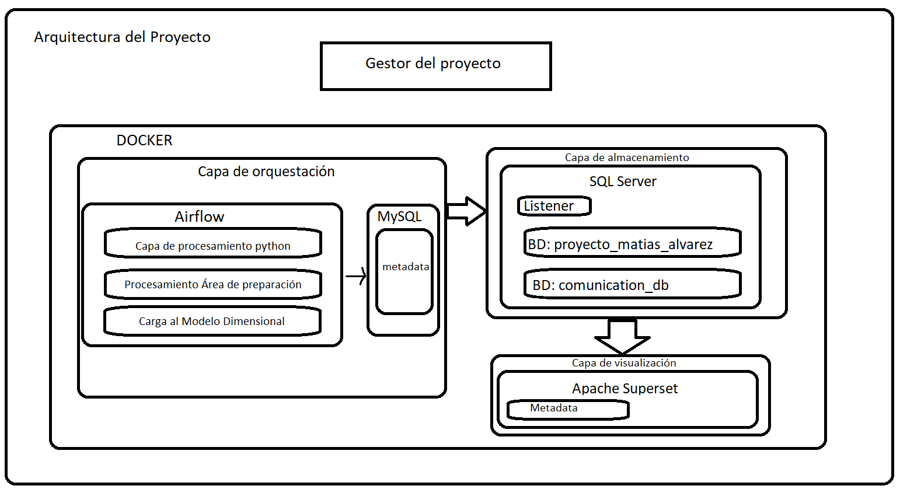 </p> -->
<p align="center">  </p>

[Link Imagen](https://i.ibb.co/NgCWxT7D/Diagrama-de-arquitectura-del-proyecto.png)

## Docker Compose y DockerFiles
La definición de servicios será definido en el archivo docker-compose.yml que se encuentra en la raíz del proyecto.  
En el mismo se definen:
- **Servicios**:
   - **Apache Airflow**: 
      - Nombre Contenedor: **airflow_proyecto_matias_alvarez**
      - Nombre de Host: **airflow**
   - **MySQL**: 
      - Nombre Contenedor: **mysql_proyecto_matias_alvarez**
      - Nombre de Host: **mysql**
   - **SQL Server 2022**: 
      - Nombre Contenedor: **sql_server_proyecto_matias_alvarez**
      - Nombre de Host: **sql_server**
   - **Apache Superset**: 
      - Nombre Contenedor: **apache_superset_proyecto_matias_alvarez**
      - Nombre de Host: **apache_superset**

- **Volúmenes**:
   - **Gestionado por Docker**:
      - **sqlserver_data_proyecto_etl** para SQL Server
      - **vol_mysql_proyecto_etl** para MySQL
      
   - **Bind mounts** (compartido entre el host y docker):
      - **Apache Airflow**:
         - **./data_services/airflow/dags:/opt/airflow/dags**   
         - **./data_services/airflow/logs:/opt/airflow/logs**    
         - **./data_services/airflow/plugins:/opt/airflow/plugins**   

- **Redes** :   
   El objetivo de estas redes es separar la comunicación entre los servicios:
   - Apache Airflow solo se puede comunicar con MySQL y MSSQL.
      - **net_airflow_mysql_proyecto_matias_alvarez**
      - **net_airflow_sql_server_proyecto_matias_alvarez**
   - SQL Server solo se puede comunicar con Apache Airflow y Apache Superset.
      - **net_sql_server_superset_proyecto_matias_alvarez**  
   - Apache Superset solo se puede comunicar con SQL Server.  
      - **net_sql_server_superset_proyecto_matias_alvarez**  

Cada servicio para ser construido utiliza su correspondiente Dockerfile que está definido en la carpeta con el nombre del servicio a construir dentro de la carpeta dockerfiles.   
El mismo define en general:
- Variables de entornos necesarias para el servicio y para el proyecto.
- Descarga de componentes de utilidad para el servicio.
- Carga de archivos desde el sistema host a una carpeta determinada del contenedor.
- Privilegios de ejecución para los script bash.
- Ejecución de comandos y scripts bash para la configuración del servicio.
- Definición del comando (CMD) predeterminado que se ejecutará cuando se inicie el contenedor.

> [!NOTE]    
> La forma correcta de implementar MySQL dada la arquitectura en capas sería a través del Dockerfile de Apache Airflow y no desplegando un contenedor.    
> La decisión de realizarlo de esta forma es simplemente simplificar un poco el proceso de creación de la base de datos de metadatos de Airflow.    
> Caso contrario habría que agregar en el dockerfile unos cuantos pasos para descargar, configurar e iniciar MySQL desde el momento de creación de Airflow.   
> Para nuestro caso de uso ganamos simplificación y desacoplamiento aunque esto último para nosotros no tiene ninguna "ventaja" dada la naturaleza del proyecto.  


## **Estructura De Carpetas Del Proyecto**

``` bash
.
├── data # Contiene las distintas etapas de procesamiento de los dataset
│   ├── Procesados # Dataset procesados o necesarios para enriquecer datos.
│   ├── SemiProcesados
│   └── SinProcesar # Carpeta inicial donde se encuentran los dataset a procesar.
├── data_services # Contiene los datos necesarios para cada servicio y sus funcionalidades.
│   ├── airflow
│   │   ├── capa_transformacion_python # Almacena la capa de procesamiento del proyecto realizada en Python.
│   │   │   ├── src # Source 
│   │   │   │   ├── ETL_tools # Solución general de herramientas ETL
│   │   │   │   │   └── methods
│   │   │   │   └── transform # Scripts encargados de procesar cada dataset
│   │   │   │       └── utils
│   │   │   └── tests # Test Unitarios y de Integración
│   │   │       └── Test_Dataset
│   │   │           └── ORIGINAL
│   │   ├── dags # Contiene los DAGs encargado de orquestar el proyecto
│   │   │   ├── ErrorTypes # Almacena clases de errores personalizadas para los DAGs
│   │   │   └── utils # Utilidades para los DAGs
│   │   ├── files # Almacena archivos para el correcto funcionamiento del servicio
│   │   ├── logs # Almacena los LOGs de los DAGs
│   │   ├── plugins # Almacena plugins de Airflow, no se utiliza pero permite extender la funcionalidad de airflow.
│   │   └── scripts # Contiene scripts y archivos de configuración necesarios para configurar e iniciar el servicio.
│   ├── mssql
│   │   ├── dataset # Almacena dataset de utilidad para la base de datos
│   │   └── scripts 
│   │       ├── SQL # Contiene todos los scripts SQL de MSSQL
│   │       │   ├── comunicacion_entre_servicios # Contiene los Scripts para la bd comunication_db
│   │       │   └── usuario_general_para_consultar_db # Contiene Script que crea un usuario que solo puede consultar las BD creadas.
│   │       ├── bash  # Contiene Scripts BASH que ejecutan las consultas SQL y devuelven un estado de salida
│   │       └── python # Contiene el Listener 
│   ├── mysql
│   │   ├── conf # Contiene el archivo de configuración de MySQL
│   │   └── scripts
│   │       ├── bash # Contiene el script para ejecutar los comandos SQL y devolver un estado de salida.
│   │       └── sql # Contiene los scripts SQL para crear la base de datos de metadatas junto al usuario encargado de la misma.
│   └── superset # Contiene el script necesario para configurar, crear un usuario administrador e iniciar superset
├── dockerfiles # Define los DockerFiles para cada servicio
│   ├── airflow
│   ├── mssql
│   ├── mysql
│   └── superset
└── project_manager # Gestor del ciclo de vida del proyecto
    └── utils # Utilidades necesarias para el funcionamiento del script
``` 

## **Credenciales Del Proyecto**

En caso que necesite verificar o interactuar con alguno de los servicios se deja una lista de todas las credenciales necesarias:  
- **Apache Airflow**:  
   - Usuario Administrador: Con este usuario podrá ingresar a la WebUI
      - usuario: **airflow** , contraseña: **airflow**.  
- **MySQL**:
   - usuario: **root** , contraseña: **Mysql_p4ssw0rd2024** 
      - Privilegios: Todos.
   - usuario: **airflow_user** , contraseña: **pass_word_airflow_db**  
      - Privilegios: Todos para la base de datos airflow_db.
- **SQL Server**:  
   - usuario: **sa** , contraseña: **Sqlserver2024)** 
      - Privilegios: Todos.  
   - usuario: **python** , contraseña: **Pyth0N_p4ssw0rd.** 
      - Privilegios:     
         Solo **inserción en las tablas del área de preparación** de la base de datos "proyecto_matias_alvarez".     
         Es necesario para la orquestación de Apache Airflow al área de preparación de los DataSet Procesados.
   - usuario: **dashboard** , contraseña:**D4shBoard)2024** 
      - Privilegios: Solo **consultas a las tablas y vistas del modelo dimensional** (dimensiones y hechos) de la base de datos "proyecto_matias_alvarez".  
   - usuario: **user_verificacion_db** , contraseña: **User_V3r1ficaci0n.** 
      - Privilegios: Solo puede **ver que base de datos existen en MSSQL**.
   - usuario: **com_user** , contraseña: **C0m_p4ssw0rd.** 
      - Privilegios: De **lectura y escritura a la tabla mensajes de la base de datos comunication_db**.
- **Apache Superset**:    
      - clave secreta: **apache_super_set_proyecto_matias_alvarez**
      - credenciales para WebUI:   
         - usuario: **superset** , contraseña: **superset**

## **Utilidades del Proyecto**

### **Project Manager**
Se diseñó un script capaz de gestionar todo el ciclo de vida del proyecto.  
El mismo utiliza los módulos:
   - **click**: Para facilitar la creación de la interfaz de la línea de comandos.
   - **os.path**: Para gestionar las rutas.
   - **subprocess** Para ejecutar comandos.  

El gestor permite:
   1) Construir todos los servicios.
   2) Iniciar el proyecto de forma automática con todas las configuraciones pertinentes generando un estado de "listo para usar".
   3) Iniciar/apagar uno, varios o todos los servicios.
   4) Iniciar/apagar el listener necesario para la comunicación entre Apache Airflow y MSSQL.
   5) Eliminar todos los servicios junto a sus volúmenes (si se desea).
   6) Gestionar los DAGs (uno o varios a la vez):
      1. Ver el estado de los mismos.
      2. Pausar y Despausar.
      3. Iniciar ejecución.  
      De esta manera no hace falta que debas ingresar a la WebUI para iniciar la orquestación de los datos.

> [!TIP]  
> Se recomienda instalar un entorno virtual para utilizar el gestor.

   ``` bash
   # Puede crear el entorno en cualquier parte del proyecto, recomiendo en la carpeta del gestor o en la raíz del proyecto.
   $ python3 -m venv venv # Recuerde que python3 debe hacer referencia a la versión 3.11

   # Ingresar al entorno virtual
   $ source venv/bin/activate

   # Instalar los requerimientos del gestor
   $ pip install -r requirements.txt  # Si se encuentra dentro de la carpeta del gestor o si no: $DIR_PROYECTO/project_manager/requirements.txt 

   # Cuando desee salir del entorno virtual
   $ deactivate
   ``` 
> [!NOTE]  
> El símbolo '$' representa que es un comando ejecutado en la terminal.  

La forma de interactuar con el mismo es la siguiente:
   ``` bash
   $ python project_manager/project_manager.py <argumento> <valor_1> <valor_2> <valor_n> 
   ``` 

- **Funciones para gestionar los contenedores**
   - **construir-servicios**: Construye todos los servicios. No recibe ningún argumento.
      Ejemplo: 
      ``` bash
         $ python project_manager/project_manager.py construir-servicios
      ``` 

   - **iniciar-proyecto**: Inicia todos los servicios y utilidades necesarias. No recibe ningún argumento.
      Ejemplo: 
      ``` bash
         $ python project_manager/project_manager.py iniciar-proyecto
      ``` 

   - **apagar-servicios**: Apaga uno o varios o todos los servicios. 
      Ejemplo: 
      ``` bash
         # Apagar el contenedor de apache Superset:
         $ python project_manager/project_manager.py apagar-servicios apache_superset_proyecto_matias_alvarez
         # Apagar todos los contendores de forma conjunta:
         $ python project_manager/project_manager.py apagar-servicios all-services
      ``` 
   - **mostrar-servicios-iniciados**  Muestra los servicios que se encuentran iniciados. No recibe ningún argumento.
      ``` bash
         $ python project_manager/project_manager.py mostrar-servicios-iniciados
      ``` 
   - **iniciar-servicios**: Inicia uno o más servicios.
      Ejemplo:
      ``` bash
         # Iniciar el contenedor de apache Superset:
         $ python project_manager/project_manager.py iniciar-servicios apache_superset_proyecto_matias_alvarez
         # Iniciar todos los contendores de forma conjunta:
         $ python project_manager/project_manager.py iniciar-servicios all-services
      ``` 

   - **eliminar-servicios**: Elimina todos los contenedores.
      ``` bash
         # Elimina todos los servicios PERO NO SUS VOLÚMENES
         $ python project_manager/project_manager.py eliminar-servicios
         # Elimina todos los servicios junto a sus volúmenes
         $ python project_manager/project_manager.py eliminar-servicios True
      ``` 
      <!-- <p align="center"> 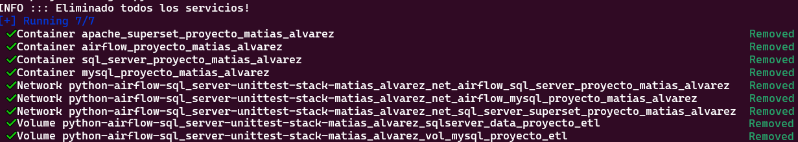 </p> -->
      <p align="center">  </p>

      [Link Imagen](https://i.ibb.co/0VChr46T/gestor-del-proyecto-eliminar-servicios.png)
- **Funciones para gestionar el Listener entre Airflow y SQL Server**
   - **iniciar-listener**: Inicia el Listener.
      ``` bash
         $ python project_manager/project_manager.py iniciar-listener
      ``` 

   - **finalizar-listener**: Finaliza el Listener.
      ``` bash
         $ python project_manager/project_manager.py finalizar-listener
      ``` 

> [!NOTE]  
> El listener es una utilidad que permite la comunicación entre Airflow y SQL Server.  
> Permite que MSSQL ejecute eventos necesarios para el correcto funcionamiento de Airflow.  
> Por ejemplo: Airflow detecta que alguna tabla o la base de datos no existe entonces envía una solicitud de creación, el listener recibe el mensaje, procesa el evento y envía un mensaje de estado ('OK', 'ALREADY DONE' o 'FAIL').    
> Basado en la respuesta Airflow ejecuta la tarea correspondiente o genera una falla.

- **Funciones para gestionar los DAGs** (Se utiliza el ID del DAG)
   - **estado-de-dag**: Muestra el estado de un DAG o varios DAGs.   
      Ejemplo: 
      ``` bash
         # Ver estado del DAG maestro:
         $ python project_manager/project_manager.py estado-de-dag proceso_completo_del_proyecto
         # Ver estado de varios DAGs (Capa de transformación python, procesamiento en MSSQL y carga al modelo dimensional):
         $ python project_manager/project_manager.py estado-de-dag procesamiento_y_carga_all_dataset procesamiento_area_preparacion carga_modelo_dimensional
      ``` 

   - **despausar-dags**: Despausa uno o más DAGs.   
      ``` bash
         # Despausar un DAG
         $ python project_manager/project_manager.py despausar-dags carga_modelo_dimensional
         # Despausar varios DAGs
         $ python project_manager/project_manager.py despausar-dags procesamiento_y_carga_all_dataset procesamiento_area_preparacion_y_carga_modelo_dimensional proceso_completo_del_proyecto
      ``` 

<!-- <p align="center"> 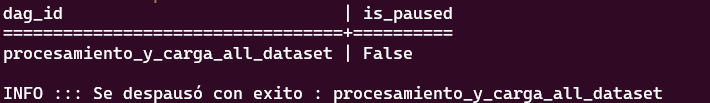 </p> -->
<p align="center">  </p>

[Link Imagen](https://i.ibb.co/FqCvgVGq/despausando-dag-con-project-manager.png)

> [!TIP]    
> Para procesar el Dag maestro ("proceso_completo_del_proyecto") debe despausar "procesamiento_y_carga_all_dataset" y "procesamiento_area_preparacion_y_carga_modelo_dimensional"   
> Caso contrario, el DAG esperará a que se termine de ejecutar "procesamiento_y_carga_all_dataset" y quedará en stand by (ejecutándose) hasta que se despause los DAGs necesarios.

   - **procesar-dags**: Inicia el proceso de ejecución del DAG.   
      ``` bash
         # Procesar un DAG
         $ python project_manager/project_manager.py procesar-dags carga_modelo_dimensional
      ```
      
   <!-- <p align="center"> 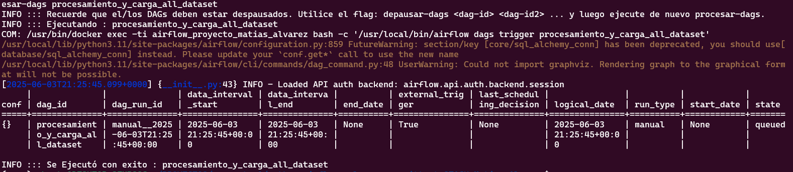 </p> -->
   <p align="center">  </p>

   [Link Imagen](https://i.ibb.co/QFPS5dFV/iniciando-ejecucion-dag-con-project-manager.png)
   
> [!IMPORTANT]  
> Antes de procesar un DAG debe haberlo despausado!

   - **pausar-dag**: Pone en pausa uno o más dags.
      ``` bash
         # Despausar un DAG
         $ python project_manager/project_manager.py pausar-dag carga_modelo_dimensional
         # Despausar varios DAGs
         $ python project_manager/project_manager.py pausar-dag procesamiento_y_carga_all_dataset procesamiento_area_preparacion_y_carga_modelo_dimensional proceso_completo_del_proyecto
      ``` 

- **Funciones de información**: 
   - **ver-dags-id**: Muestra los ID de los DAGs junto a una descripción de los mismos.
      ``` bash
         $ python project_manager/project_manager.py ver-dags-id
      ``` 
      <!-- <p align="center"> 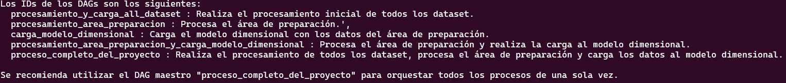 </p> -->
      <p align="center">  </p>

      [Link Imagen](https://i.ibb.co/HTH2q4v3/visualizacion-de-los-dag-ids.png)

   - **ver-informacion-contenedores**: Muestra información de los contendores (nombre de contendor y host, puerto, requerimientos, etc).
      ``` bash
         $ python project_manager/project_manager.py ver-informacion-contenedores
      ``` 
      <!-- <p align="center"> 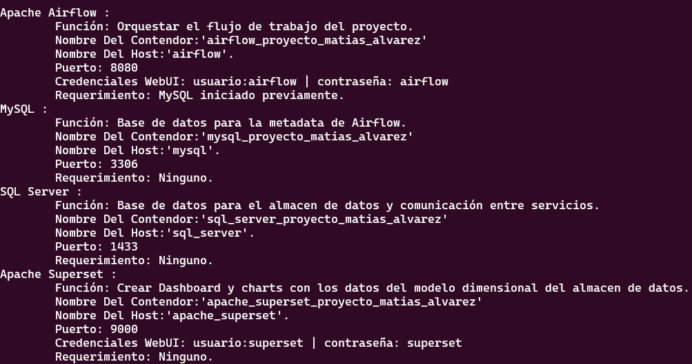 </p> -->
      <p align="center">  </p>

      [Link Imagen](https://i.ibb.co/JRgj6T5f/gestor-del-proyecto-informacion-de-los-contenedores.png)

   - **ver-url-webui**: Muestra las URL de las WebUI de los servicios Apache Airflow y Apache Superset.
      ``` bash
         $ python project_manager/project_manager.py ver-url-webui
      ``` 
      <!-- <p align="center"> 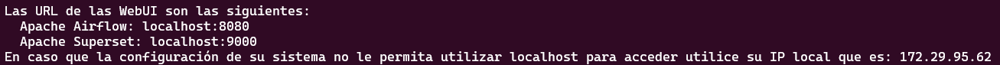 </p> -->
      <p align="center">  </p>

      [Link Imagen](https://i.ibb.co/jZRcxQvz/gestor-del-proyecto-ver-url-webui.png)

> [!NOTE]  
> En su caso la IP mostrará su IP Local.


> [!TIP]      
> En cualquier momento puedes utilizar el flag --help para ver cómo utilizar el gestor.    
>  <!-- <p align="center">  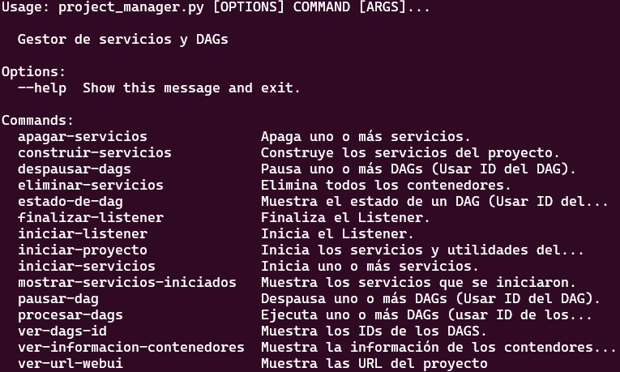 </p> -->
>  <p align="center">  </p>    
>   
>  [Link Imagen](https://i.ibb.co/B21j8mvN/ejemplo-mensaje-de-ayuda-project-manager.png)   


El orden general del proyecto utilizando el gestor es el siguiente:
   1. **construir-servicios**: Genera la construcción de todos los servicios basados en el docker-compose.yml. **Debe realizarse una única vez!**
   2. **iniciar-proyecto**: Inicia todos los servicios en el orden y tiempo de espera correspondiente e inicia el Listener.
   3. **despausar-dags**: Despausar los DAGs necesarios. Recuerde que debe despausar un DAG antes de iniciarlo.  
      Los ID de los DAGs son los siguientes:
       - **procesamiento_y_carga_all_dataset**: Procesamiento capa Python. 
       - **procesamiento_area_preparacion**: Procesamiento del área de preparación en MSSQL.
       - **carga_modelo_dimensional**: Carga al Modelo Dimensional luego de haber procesado el área de preparación.
       - **procesamiento_area_preparacion_y_carga_modelo_dimensional**: Procesa el área de preparación y carga el modelo.
       - **proceso_completo_del_proyecto**: Ejecuta el DAG 1 y el DAG 4. Se recomienda esta opcion para simplificar el recorrido del proyecto.
   4. **procesar-dags**: Procesar los DAGs. 
   5. **estado-de-dag**: Ver el estado de uno o varios DAGs.


### **Listener**
El script Listener definido en "./data_services/mssql/scripts/python/listener.py" es de gran importancia para la correcta ejecución del proyecto y del ciclo de vida del mismo.  
Se encarga que Apache Airflow y MSSQL estén comunicados permitiendo responder (o resolver) a solicitudes de Apache Airflow al momento de estar procesando algún DAG.

Por ejemplo Apache Airflow puede pedir:
- Crear la base de datos "proyecto_matias_alvarez" con todos los requerimientos de la misma.
- Procesar el área de preparación.
- Cargar el modelo dimensional con los datos del área de preparación.
- Testear la conexión.
- Cerrar el Listener para liberar recursos.

El objetivo del mismo es separar la responsabilidad de Apache Airflow de ejecutar sentencias SQL o script SQL que dependen y se encuentran en el contenedor de SQL Server.

Ahora, la pregunta es por qué utilizar esta estrategia contra opciones más válidas como implementar un broker de procesamiento o utilizar un API para la comunicación o alguna estrategia similar y la respuesta es que dado el caso de uso del proyecto esta solución es suficiente para lograr el objetivo de separar las responsabilidades junto a evitar gastar mas recursos y tiempo en la creación de algunas de las estrategias mencionadas.

Su funcionamiento es el siguiente:
1. El listener estará escuchando la tabla "mensajes" de la base de datos "comunication_db" cada 5 o 10 segundos (de esta forma se evita estar gastando recursos en consultar cada segundo la tabla).
2. Cuando reciba un mensaje verificará si el mensaje es válido.
3. Si es válido ejecuta la petición deseada, caso contrario lo ignora.
4. Envia un mensaje al servicio emisor del mensaje (Airflow) mencionado que se recibió el mensaje.
5. Envía otro mensaje mencionando el resultado del procesamiento.
6. Según la respuesta a la solicitud se elige la siguiente tarea a ejecutar.

Por ejemplo, asumamos que Apache Airflow quiere procesar el área de procesamiento y cargar el modelo dimensional en un solo proceso.   
1. Crea un ID de correlación (CID) para el mensaje a enviar. De esta forma puede saber en todo momento cómo va su petición.
2. Inserta un registro en la tabla "mensajes" con los siguientes valores:
   ``` sql 
      CID='6484dac0-470c-4920-b16f-62794805756d', mensaje='procesar_y_iniciar_modelo', estado='pendiente'.
   ``` 
3. El Listener recibe el mensaje y lo verifica. 
4. El proceso pertinente se ejecuta. Previamente envió un mensaje con el mensaje "recibido" y con resultado OK.
5. Inserta un registro en la misma tabla con los siguientes valores según el caso de la solicitud: 
   - **Éxito**: 
      ``` sql 
      CID=6484dac0-470c-4920-b16f-62794805756d, mensaje='procesar_y_iniciar_modelo', estado='procesado', resultado='OK'
      ``` 
> [!IMPORTANT]  
> Si el evento ya fue procesado antes o el recurso ya existe el resultado devuelto es 'ALREADY DONE' en vez de 'OK'
   - **Error o Falla**: 
      ``` sql 
      CID=6484dac0-470c-4920-b16f-62794805756d, mensaje='procesar_y_iniciar_modelo', estado='procesado', resultado='FAIL'
      ``` 
6. Apache Airflow recibe el mensaje y según el resultado se determina a qué tarea de la rama (branch) debe continuar. A su vez envía un mensaje al Listener de que recibió el mensaje.
   ``` sql 
      CID='6484dac0-470c-4920-b16f-62794805756d', mensaje='Recibido', estado='procesado', resultado='OK'.
   ``` 

En forma de diagrama de secuencia se vería algo asi:
<!-- <p align="center"> 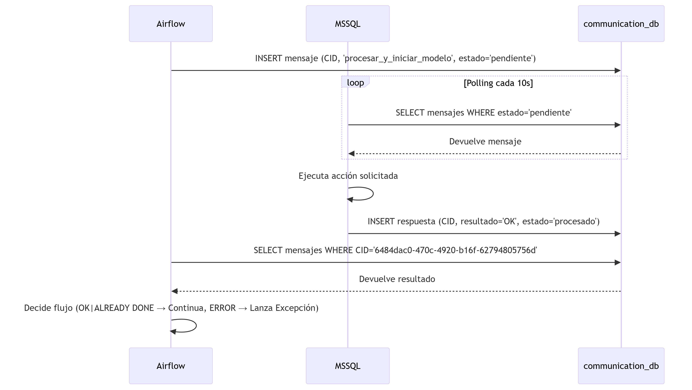 </p> -->
<p align="center">  </p>

[Link Imagen](https://i.ibb.co/B5P9STvG/diagrama-de-secuencia-listener.png)

## **Desarrollo del Proyecto**
En esta sección se inicia la explicación de las distintas capas del proyecto.  
Recordemos que las capas son:
- Orquestación: Contiene todo el proceso de orquestación junto a la capa de procesamiento desarrollada en Python.
- Almacenamiento: Contiene el Data Warehouse junto a la base de datos de comunicación y el script Listener.
- Visualización: Contiene el servicio Apachse Superset y su metadata.

Para generar una mayór coherencia en la explicación voy a empezar explicando la capa de procesamiento que se encuentra dentro de la capa de orquestación.  
Luego seguirá el flujo normal de las capas.  

<p align="center"><em>Ejemplo visual para entender la capa de orquestación.</em></p>
<!-- <p align="center"> 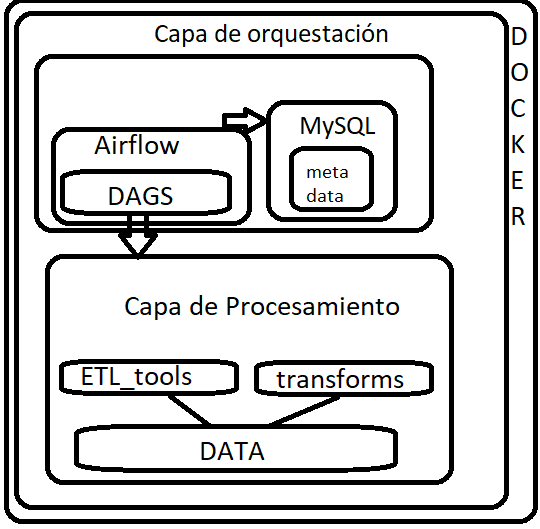 </p> -->
<p align="center">  </p>

[Link Imagen](https://i.ibb.co/vpKBh6w/ejemplo-diagrama-arq-capa-orquestacion.png)


## **Capa De Procesamiento**
Para lograr un mayor entendimiento  de esta capa voy a explicar previamente los detalles importantes a tener en cuenta como por ejemplo la diferencia entre tipos de duplicados y su gestión en el proyecto como la explicación en más profundidad del esquema de los datos fuentes, la lógica seguida para casos de valores faltantes, etc. Luego se pasará a la  importancia y utilización de cada script de la carpeta /capa_transformacion_python/src y los pasos de transformación seguidos para cada dataset.

### **Diferenciación de Duplicados Directos y No Directos**

- 1. **Duplicado Directo**: Un duplicado directo se refiere a un registro completo que se repite en el dataset. En este caso, es necesario eliminar todos los duplicados, excepto el primero, para evitar redundancias y errores en los análisis.

- 2. **Duplicado No Directo**: Un duplicado no directo ocurre cuando se tienen dos o más registros que hacen referencia al mismo elemento, pero cada uno tiene un ID principal distinto. En este caso, se deben identificar o eliminar los registros duplicados (según la estrategia) y luego actualizar las tablas correspondientes con el ID correcto.

Supongamos que tenemos las siguientes lista de tuplas:  
``` python 
[
 (1, 'Matías Alvarez', 'Data Engineer'),
 (2, 'Test', 'Test'),
 (1, 'Matías Alvarez', 'Data Engineer'),
 (3, 'Matías Alvarez', 'Data Engineer')
]
``` 
- **Duplicado Directo**  
    En este caso, las tuplas (1, 'Matías Alvarez', 'Data Engineer') aparecen dos veces. Estas son consideradas duplicados directos. 
    La estrategia es eliminar los duplicados (directos) y dejar solo las siguientes tuplas:
    ``` python 
    [
     (1, 'Matías Alvarez', 'Data Engineer'),
     (2, 'Test', 'Test'),
     (3, 'Matías Alvarez', 'Data Engineer')
    ]
    ```     

- **Duplicado No Directo**  
    Siguiendo con las tuplas restantes:  
    ``` python 
    [
     (1, 'Matías Alvarez', 'Data Engineer'),
     (2, 'Test', 'Test'),
     (3, 'Matías Alvarez', 'Data Engineer')
    ]
    ```     

    Las tuplas 
    ``` python
    (1, 'Matías Alvarez', 'Data Engineer') y (3, 'Matías Alvarez', 'Data Engineer') 
    ```    
    hacen referencia al mismo elemento, pero con IDs diferentes. Esto se considera un duplicado no directo.   

    La estrategia para manejar este caso puede ser una de las siguientes:
    - Opción 1: Eliminar el duplicado y actualizar las referencias en otras tablas  
        Eliminar la tupla duplicada y, en los casos correspondientes, actualizar los registros en otras tablas que utilicen el ID 3 para que utilicen el ID correcto 1. 
        El resultado final sería: [(1, 'Matías Alvarez', 'Data Engineer'), (2, 'Test', 'Test')]

    - Opción 2: Mantener la tupla pero agregando al esquema dos columnas adicionales y actualizar las referencias en otras tablas. 
    Estas columnas deben ser:   
        - **Una columna booleana** que indique si la tupla fue descartada (por ejemplo, 0 o 1).   
        - **Una columna para el ID correcto**, que hace referencia al ID que se considera como el correcto (en este caso, 1).  
        Con este enfoque, el conjunto de datos se vería de la siguiente forma:   
            ``` python 
            [
             (1, 'Matías Alvarez', 'Data Engineer', 0, 1),
             (2, 'Test', 'Test', 0, 2),
             (3, 'Matías Alvarez', 'Data Engineer', 1, 1)
            ]
            ```     

        En este ejemplo:
        - La tupla **(1, 'Matías Alvarez', 'Data Engineer', 0, 1)** es el registro original.
        - La tupla **(3, 'Matías Alvarez', 'Data Engineer', 1, 1)** indica que es un duplicado no directo (donde el 1 en la columna de descarte indica que la tupla fue marcada como duplicada -primer 1-), y su ID correcto es 1 (segundo 1).

        Este enfoque es útil cuando es necesario mantener un historial de los registros duplicados y sus relaciones con el ID correcto, sin perder ninguna información. Tener en cuenta que luego debe ignorarse el duplicado directo (segunda tupla) al momento de realizar la carga al modelo dimensional.     
        **La segunda opción es la que se utilizará en el proyecto.**  
        Por lo tanto para este enfoque se agregara dos columnas: 'Id{nombre_tabla}_Descartado' que hace referencia a que el registro es un duplicado no directo y 'Id{nombre_tabla}_Correcto' que hace referencia al ID correcto.

        Ejemplo: Caso de tabla (en el área de preparación) Proveedor
         <p align="center"><em>Ejemplo de actualización en tmp_proveedor para los IdProveedor de ID duplicado no directo.</em></p>
        <p align="center">
        <!-- 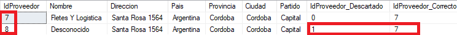 -->
        

        [Link Imagen](https://i.ibb.co/d0nVP4mR/ejemplo-duplicado-no-directo-proveedor.png)
        </p>
        <p align="center"><em> Se marca IdProveedor_Descartado = 1 y se almacena el ID correcto en IdProveedor_Correcto. Tener en cuenta que cuando se cargue la dimensión proveedor los ID a cargar son los que pertenecen a IdProveedor_Correcto.</em></p>

> [!NOTE]  
> Dado que en la imagen no entraba todos los campos la consulta solo se muestran unas pocas columnas para mostrar que hacen referencia al mismo registro.

  <p align="center"><em>Ejemplo de actualización en tmp_compra para los IdProveedor de ID duplicado no directo. </em></p>
  <!-- <p align="center">  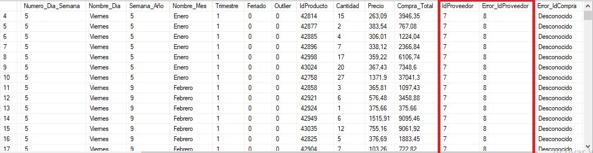 </p> -->
  <p align="center">   </p>

  [Link Imagen](https://i.ibb.co/0pJRnwqX/ejemplo-duplicado-no-directo-proveedor-actualizacion-tabla-compra.png)
<p align="center"><em>Error_IdProveedor almacena el ID incorrecto que en este caso es 8 y el IdProveedor actualiazado almacena el IdProveedor_Correcto de la tabla tmp_proveedor (con IdProveedor = 8).</em></p>
<p align="center"><em>Tener en cuenta que se ven todos los datos juntos porque esta filtrando por Error_IdProveedor = '8' en la tabla tmp_compra.</em></p>

### **Valores Desconocidos**
En todo el proyecto se utilizará los siguientes valores para determinar valores desconocidos:
   - **'Desconocido'** : Para columnas de tipo cadena.
   - **-1** : Para columnas de tipo entero.
   - **-1.0** : Para columnas de tipo flotante.
   - **9999-12-31** : Para columnas de fecha.

> [!IMPORTANT]  
> En la desnormalización de fechas de tipo entero (día, mes, año) se utilizará el valor -1 para identificar un valor desconocido.

## **Datos Iniciales VS Datos Finales**
Inicialmente se cuenta con 11 archivos que contienen las siguientes columnas:

1. **Canal_venta.csv**: Información de los canales de venta.
   - **IdCanal**: Contiene el ID principal de cada canal. Se espera un número entero. 
   - **Descripcion**: Contiene la descripción del tipo de canal. Por ejemplo: "Online", "Presencial", "Telefónico". Se espera una cadena.

2. **Clientes.csv**: Información de clientes, como localidad, edad, y dirección.
   - **ID**: Contiene el ID principal de cada cliente.
   - **Provincia**: Contiene la provincia del cliente. Se espera una cadena.
   - **Nombre_y_Apellido**: Contiene el nombre y apellido de cliente.  Se espera una cadena.
   - **Domicilio**: Contiene el domicilio del cliente. Se espera una cadena.
   - **Edad**: Contiene la edad del cliente. Se espera una cadena.
   - **Localidad**: Contiene la localidad del cliente. Se espera una cadena.
   - **X**: Contiene la latitud del cliente (el X es un nombre que se le puso no hace referencia a la posición de una recta). Se espera una cadena.
   - **Y**: Contiene la longitud del cliente (el Y es un nombre que se le puso no hace referencia a la posición de una recta). Se espera una cadena.
   - **col10**: No contiene valores. 

3. **Compra.csv**: Detalles de cada compra realizada en cada proveedor, incluyendo producto, cantidad, proveedor y precio.
   - **IdCompra**: Contiene el ID de referencia a cada compra. Se espera un número entero.
   - **Fecha**: Contiene la fecha de cada Compra en un formato 'MM/DD/AA' (MDA). Se espera una cadena.
   - **Fecha_Año**: Contiene el año de la compra. Se espera un número entero.
   - **Fecha_Mes**: Contiene el mes de la compra. Se espera un número entero. 
   - **Fecha_Periodo**: Contiene el periodo de la compra en el formato AAAAMM. Se espera una cadena.
   - **IdProducto**: Contiene el ID del producto comprado. Se espera un número entero.
   - **Cantidad**: Contiene la cantidad del producto comprado. Se espera una cantidad.
   - **Precio**: Contiene el precio del producto. Se espera un valor real.
   - **IdProveedor**: Contiene el ID del proveedor al que se realizo la compra. Se espera una número entero.

4. **Empleado.csv**: Datos de empleados, incluyendo cargo, sector y salario.
   - **ID_empleado**: Contiene el ID de referencia a un empleado. Se espera un número entero.
   - **Apellido**: Contiene el apellido del empleado. Se espera una cadena.
   - **Nombre**: Contiene el nombre del empleado. Se espera una cadena.
   - **Sucursal**: Contiene el nombre de la sucursal del empleado. Se espera una cadena.
   - **Sector**: Contiene el sector del empleado. Se espera una cadena.
   - **Cargo**: Contiene el cargo del empleado. Se espera una cadena.
   - **Salario**: Contiene el salario del empleado. Se espera un real.

5. **Gasto.csv**: Gastos de cada sucursal, con tipo de gasto, monto y fecha.
   - **IdGasto**: Contiene el ID de referencia a un gasto. Se espera un número entero.
   - **IdSucursal**: Contiene la ID de la sucursal que realizo el gasto. Se espera un número entero.
   - **IdTipoGasto**: Contiene el ID del tipo de gasto que se realizó. Se espera un número entero.
   - **Fecha**: Contiene la fecha en la que se realizó el gasto. Tiene un formato 'AA-MM-DD' (AMD). Se espera una cadena.
   - **Monto**: Contiene el monto gastado. Se espera un real.

6. **Producto.csv**: Información de productos, incluyendo precio y tipo.
   - **IdProducto**: Contiene el ID de referencia a un producto. Se espera un número entero.
   - **Producto**: Contiene el nombre del producto. Se espera una cadena.
   - **Precio**: Contiene el precio del producto. Se espera un valor real.
   - **IdTipoProducto**: Contiene el ID de referencia del tipo de producto. Se espera un número entero.

7. **Proveedor.csv**: Datos de los proveedores, como nombre y ubicación.  
   - **IDProveedor**: Contiene el ID de referencia a un proveedor. Se espera un número entero.
   - **Nombre**: Contiene el nombre del proveedor. Se espera una cadena.
   - **Address**: Contiene la dirección del proveedor. Se espera una cadena.
   - **City**: Contiene la ciudad del proveedor. Se espera una cadena.
   - **State**: Contiene la provincia del proveedor. Se espera una cadena.
   - **Country**: Contiene el país de proveedor. Se espera una cadena.
   - **departamen**: Contiene el departamento/partido del proveedor. Se espera una cadena.

8. **Sucursal.csv**: Información sobre cada sucursal de la empresa.  
   - **ID**: Contiene el ID de referencia a una sucursal. Se espera un número entero.
   - **Sucursal**: Contiene el nombre de la sucursal. Puede haber más de una misma sucursal con un nombre pero es diferenciado con un número. Se espera una cadena.
   - **Direccion**: Contiene la dirección de la sucursal. Se espera una cadena.
   - **Localidad**: Contiene la localidad de la sucursal. Se espera una cadena.
   - **Provincia**: Contiene la provincia de la sucursal. Se espera una cadena.
   - **Latitud**: Contiene la latitud de la sucursal. Se espera una cadena.
   - **Longitud**: Contiene la longitud de la sucursal. Se espera una cadena.

9. **Tipo_Producto.csv**: Tipo de cada producto.  
      - **IdTipoProducto**: Contiene el ID de referencia a un tipo de producto. Se espera un número entero.
      - **TipoProducto**: Contiene la descripción del Tipo de producto (por ejemplo: "Audio", "Bases", "Estucheria", etc). Se espera una cadena.

10. **TipoGasto.csv**: Tipos de gastos y montos aproximados.  
      - **IdTipoGasto**: Contiene el ID de referencia al tipo de gasto. Se espera un número entero.
      - **Descripcion**: Contiene la descripción del tipo de gasto. Se espera una cadena.
      - **Monto_Aproximado**: Contiene un monto aproximado del tipo de gasto. Se espera un número entero.

11. **Ventas.csv**: Ventas con información detallada de productos, precios, y sucursales.  
      - **IdVenta**: Contiene el ID de referencia a una venta. Se espera un número entero.
      - **Fecha**: Contiene la fecha de venta. Contiene un formato 'AAAA-MM-DD' (AMD). Se espera una cadena.
      - **Fecha_Entrega**: Contiene la fecha de entrega. Contiene un formato 'AAAA-MM-DD' (AMD). Se espera una cadena.
      - **IdCanal**: Contiene el ID del canal de venta por el que se realizó.
      - **IdCliente**: Contiene el ID del cliente al que se realizó la venta.
      - **IdSucursal**: Contiene el ID de la sucursal que realizó la venta.
      - **IdEmpleado**: Contiene el ID del empleado que realizó la venta.
      - **IdProducto**: Contiene el ID del producto que se vendió.
      - **Precio**: Contiene el precio del producto vendido.
      - **Cantidad**: Contiene la cantidad vendida del producto. Se espera un número entero.

> [!NOTE]   
> Recordemos que los equipos de trabajo no trabajaban de forma conjunta por lo que descargaban los datos de la base de datos operativa en el formato más fácil para cada uno.   
> De esta forma es que hay distintas extensiones y encoding.   
> Para facilitar el proyecto asumimos que nos entregan los archivos.      

Con una vista rápida podemos ver o intuir que tendremos algunos problemas como:
   - Error de inserción upstream de datos en las columnas (por ejemplo se esperan ID enteros y se encuentren alfanuméricos).
   - Errores de inserción de datos ficticios, desnormalizados o corridos (Por ejemplo Provincias que tengas valores como 'BS AS', 'CABA', 'Buenos Ayres', etc).   
      Corridos hace referencia a filas registradas donde sus valores corresponden a la columna anterior o siguiente.
   - Valores faltantes ó desconocidos (descripciones, precios, etc).
   - Valores sin sentido (outliers) en precios, montos y cantidades.
   - Eliminar duplicados directos.
   - Encontrar y marcar aquellos duplicados no directos.
   - Columnas innecesarias o sin sentido que deben eliminarse.
   - Traducción de columnas (renombres).
   - Formatos no normalizados en descripciones, fechas, etc (Por ejemplo en fechas que existan formato AMD y MDA ó en descripciones que estén en mayúscula) 
   - ID que existan en tablas como ventas (por ejemplo clientes, sucursales, cualquiera que pudiera explicar un contexto de venta) y no exista en su dimensión

Además de solucionar estos primeros errores que podemos observar o intuir que también debemos:
   - Proponer un mismo formato para campos como:
      1. Fechas : Donde se utilizará siempre un formato AAAA-MM-DD (AMD)
      2. Descripciones : Donde se utilizará siempre un formato Title (primera letra mayúscula de cada palabra)
   - Desnormalizar columnas como Fechas en columnas como:  
      1. Número de día.
      2. Número de mes.
      3. Año del mismo.
      4. Periodo del mismo (siguiendo siempre el formato AAAAMM, por ejemplo 202401).
      5. Nombre del Día.
      6. Nombre del Mes.
      7. Número de Semana del año.
      8. Trimestre del año.
      9. Si es Feriado en Argentina.
      10. ID de la fecha, siempre siguiendo el formato AAAAMMDD
      11. En caso que haya fechas de envíos (inicio y entrega) se debe proveer una columna que contenga el tiempo tardado de completación.
   - Desnormalizar sucursales en columnas como:
      1. Nombre de la sucursal. 
      2. Número Sucursal (Por defecto es 1 caso contrario va incrementándose de a 1 por cada sucursal en una misma zona/localidad).
      3. Sucursal completa (Nombre de la sucursal + Número de la sucursal).
   - Desnormalizar las sociedades de los proveedores en columna como:
      1. Tipo Sociedad resumida (Por ejemplo SA, SRL, etc)
      2. Nombre completo del tipo de sociedad (Por ejemplo, Sociedad Anónima, Sociedad de Responsabilidad Limitada, etc )
   - Desnormalizar datos basados en edades en columnas como:
      1. Grupo Etario. Por ejemplo "Niñez", "Adolescencia", "Juventud" y "Adultez".
      2. Si es mayor de edad.
   - Desnormalizar nombres y apellidos de los clientes (en Primer Nombre, Segundo Nombre, Tercer Nombre, Primer Apellido, Segundo Apellido, Tercer Apellido, Nombre completo y Apellido completo). Son 3 nombres y apellidos ya que la ley argentina establece ese limite como máximo.
   - Desnormalizar los productos en Marca, Modelo y Componentes.
   - Almacenar aquellos valores que se consideran erróneos para poder trazar los mismos y también dado el caso que no sea un error verdadero volverlo a utilizar.
   - Marcar como descartado aquellos ID que ya no son válidos ya sea porque nacieron de un error de inserción, test ó duplicación no directa.
   - Actualizar aquellos valores erróneos por el valor desconocido correspondiente según el tipo de dato ("Desconocido" para cadenas, -1 para enteros ó -1.0 para reales).
   - En dataset como ventas o compras debe proveerse total generado (precio*cantidad) en cada transacción.

> [!TIP]  
> Todos estos detalles generarán un alto impacto en el modelo de datos dimensional.

### **Ejemplo RAW DATA vs Procesados**
Ejemplo de los datos crudos y los datos ya procesados en Python (desde SQL Server Management Studio):   
> [!TIP]  
> "RAW DATA" es solo para ejemplificar, en ningún momento de este proyecto se carga los datos crudo a alguna tabla de la base de datos.

(1) **Sucursal RAW DATA vs tmp_sucursal**
<p align="center">
  <!-- 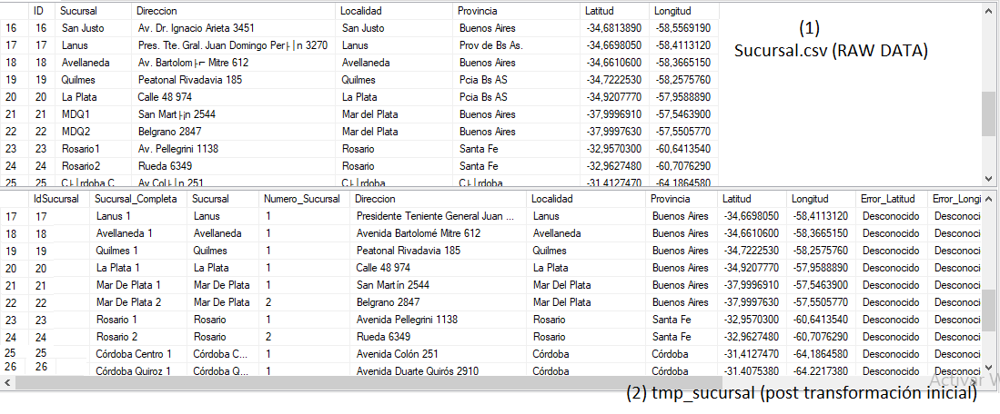 -->
  

  [Link Imagen](https://i.ibb.co/qL7ggNYf/ejemplo-sucursal-raw-data-vs-etl-nifi.png)
</p>
<p align="center"><em>Ejemplo de Sucursal crudo (1) vs Sucursal post procesamiento capa python (2) almacenado en su tabla correspondiente del área de preparación.</em></p>

(2) **Gasto RAW DATA vs tmp_gasto**
<p align="center">
  <!-- 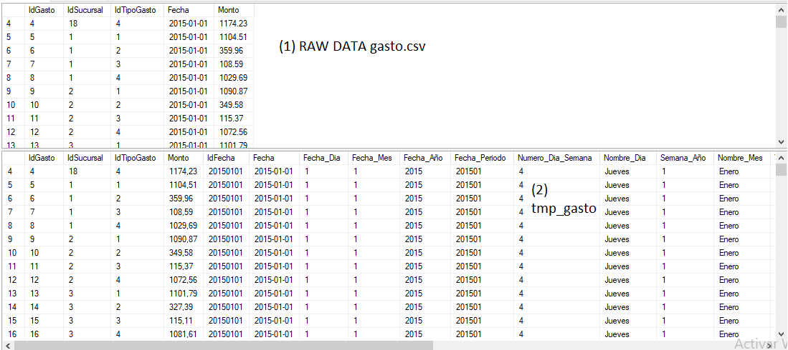 -->
  

  [Link Imagen](https://i.ibb.co/YxhbNRW/ejemplo-gasto-raw-data-vs-etl-nifi.png)
</p>
<p align="center"><em>Ejemplo de gasto crudo (1) vs gasto post procesamiento capa python (2) almacenado en su tabla correspondiente del área de preparación.</em></p>

(3) **Ejemplo IDs principales duplicados y solución en Empleados**  
Cuando se encuentra IDs Principales duplicados (Id con una aparición mayór o igual a 2) que hacen referencia a datos distintos lo que se hace es almacenar en las columnas Error_Id{nombre_tabla} el Id{nombre_tabla} correspondiente y luego se almacena en Id{nombre_tabla}_Correspondiente un nuevo ID que no haya sido utilizado. Se verifica si el nuevo ID a asignar no existe y en caso que exista se vuelve a calcular. 

<p align="center">
  <!-- 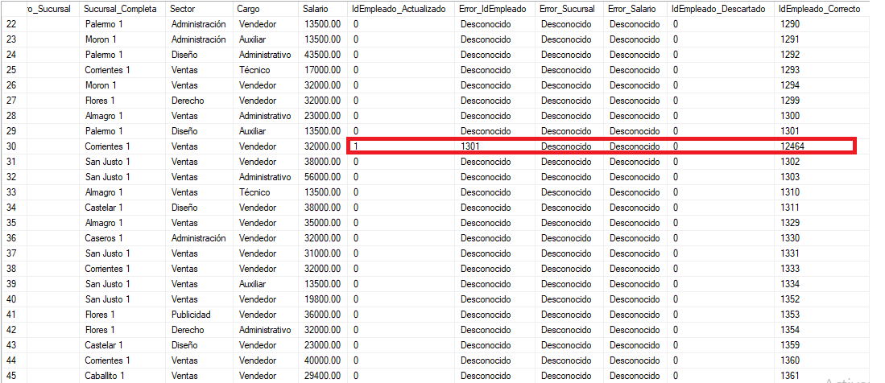 -->
  

  [Link Imagen](https://i.ibb.co/XkW9n0V7/ejemplo-id-duplicados-y-resolucion-empleado.png)
</p>
<p align="center"><em>Ejemplo de solución a duplicado en ID principal de Empleado notar que se marca con: mención a ID actualizado (IdEmpleado_Actualiazado = 1), almacenamiento del ID ORIGINAL duplicado (Error_IdEmpleado) y nuevo ID correcto (IdEmpleado_Correcto).</em></p> 
<p align="center"><em>Tener en cuenta que cuando se cargue la dimensión empleado los ID a cargar son los que pertenecen a IdEmpleado_Correcto.</em></p>

<p align="center">
  <!-- 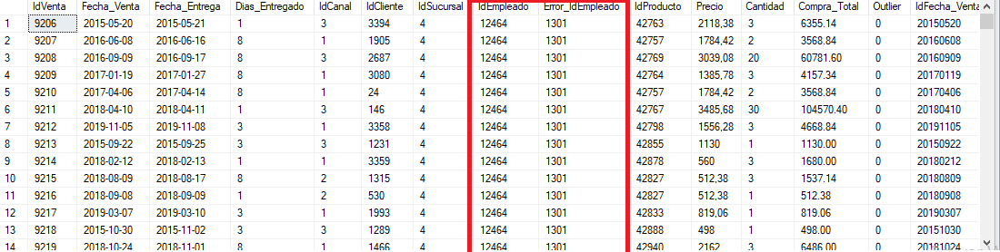 -->
  

  [Link Imagen](https://i.ibb.co/G3MGX9GM/ejemplo-id-duplicados-y-resolucion-empleado-actualizado-para-venta.png)
</p>
<p align="center"><em>Ejemplo de actualización de los ID duplicados con su correspondiente ID en la tabla tmp_venta. Para identificar correctamente cada IdEmpleado correspondiente en venta debe tenerse en cuenta de que Sucursal se realizó la venta de esta forma se puede actualizar correctamente con el ID correspondiente.</em></p>

<p align="center">
  <!-- 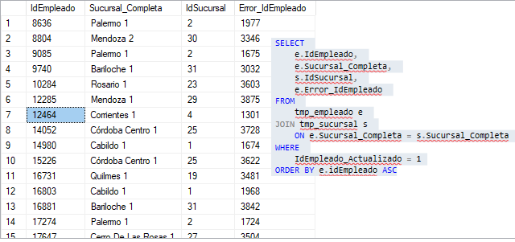 -->
  

  [Link Imagen](https://i.ibb.co/VX987tf/ejemplo-Id-Empleado-duplicado-y-su-id-correspondiente.png)
</p>
<p align="center"><em>Ejemplo de cómo se identifica el correspondiente nuevo IdEmpleado según cada sucursal. De esta forma podemos observar que el id erróneo (duplicado) con valor 1301 del ejemplo anterior tenía un IdSucursal = 4 y en esta query vemos que el IdSucursal = 4 y con Error_IdEmpleado = 1301 corresponde el ID 12464 como observamos en la imagen anterior. </em></p>

<p align="center">
  <!-- 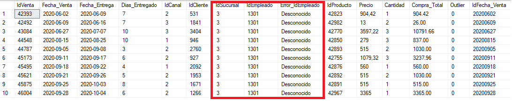 -->
  

  [Link Imagen](https://i.ibb.co/TD501pqD/ejemplo-idempleado-1301.png)
</p>
<p align="center"><em>Si observamos de que sucursal es el correspondiente IdEmpleado = 1301 es IdSucursal = 3 (y no 4, por eso se actualiza el Error_IdEmpleado=1301 y IdSucursal = 4 con el IdEmpleado 12464). NOTA: El Error_IdEmpleado de esta tabla hace referencia así había un error en el momento de procesamiento de Sucursal, por eso aparece "Desconocido" </em></p>

(4) **Columnas para almacenar los errores encontrados**  
Siempre que se detecta un error antes de solucionarlo o almacenar un error de tipo Desconocido (según el tipo de dato) se almacena el error en su columna correspondiente.    
Luego se actualiza el valor en la columna donde se encontró el error. 

Esto permite:
   - Trazar todos los errores de upstream.
   - En caso que fuera un falso positivo se puede volver a recuperar el valor.
   - Mencionar al encargado del upstream los tipos de errores encontrados y crear la posibilidad de crear estrategias y solucionar los mismos.
   - Generar estadísticas de los errores como: más comunes, tipos, etc.
   - Obtener posible valor correcto dado el mismo error. Por ejemplo, el valor erróneo tiene un cero de más al final.

La detección de estos errores se realiza a través de:
   - Expresiones REGEX.
   - Errores observados previamente en la etapa de exploración de los datos (EDA).

Las columnas generadas para seguir el rastro de errores son:   
   - **Error_{NOMBRE_COLUMNA}** :     
      Almacena el valor erróneo detectado.    
      Ahora {NOMBRE_COLUMNA} puede mantener un valor establecido como DESCONOCIDO para ese campo o actualizarse por un valor considerado correcto para el mismo.
   - **{ID_PRINCIPAL}_Actualizado** : Establece que un ID era duplicado no directo y fue actualizado.
   - **{ID_PRINCIPAL}_Correcto** :     
      Establece el ID que corresponde a ese registro.    
      De utilidad combinado con {ID_PRINCIPAL}_Actualizado ya que permite seguir la línea de aquellos registros que tenian un ID erroneo que pertenece a otro ID (si se tiene suerte se podria hasta trazar en que momento empieza el error en el upstream si se puede hablar con el proveedor del mismo).     
      En el área de preparación previa carga al modelo dimensional se utiliza este ID como ID representativo del registro.

<!-- <p align="center"> 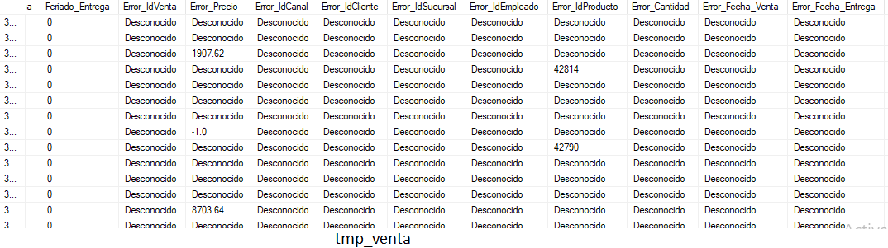 </p> -->
<p align="center">  </p>

[Link Imagen](https://i.ibb.co/RGtPJ4ZH/ejemplo-columnas-de-almacenamiento-de-errores-tmp-venta.png)
<p align="center"><em>Ejemplo de la tabla tmp_venta en las columnas de para trazar todos los errores detectados.</em></p>

### **Procesamiento de los datos**
Para llevar a cabo el ETL inicial del proyecto se utiliza las siguientes librerías:

- **pandas**: Para la carga, transformación y almacenado de los datasets.
- **numpy**: Para ciertos procesos de transformación de los DataFrame. Numpy ofrece funciones vectorizadas que permiten procesar los datos de forma veloz.
- **chardet**: Para la detección del encoding de los Dataset. 
- **unidecode**: Para convertir texto Unicode a ASCII.
- **openpyxl**: Para procesar archivos excel permitiendo su carga a DataFrame.

Para el procesamiento se utilizará siempre que sea posibles las funciones vectorizadas provista por Pandas y Numpy para lograr la mayór velocidad de procesamiento posible.    
Se evita usar bucles o métodos que no sean eficientes.     
Se documentan los métodos y pasos realizados para mejorar la claridad del proyecto.   
De esta forma se logra cargar, procesar y almacenar de forma exitosa.

El funcionamiento de los scripts se pueden resumir en la siguiente lista
- **src**: Carpeta donde se almacenan las fuentes de todos los scripts necesarios.
   - **ETL_tools**: Carpeta que define los scripts con los métodos de todo el proceso ETL necesario.
      - **methods**: Contiene los Métodos necesarios para procesar datasets. 
         - **FileUploadTools.py**: Métodos encargados de obtener de forma correcta los dataset en una estructura DataFrame de pandas.
            - Detección automática de separadores para CSV.
            - Detección y transformación de encodings. 
            - Carga de archivos en formato DateFrame.
         -  **ClientMethods.py**: Métodos relacionados para procesar datasets de clientes.
            - Obtener grupos etarios basados en una edad.
            - Dersnomarlización de nombre y apellidos en nombre_1, nombre_2, nombre_3, apellido_1, apellido_2 y apellido_3.
         - **DateMethods.py**: Métodos relacionados para tratar fechas: 
            - Desnormalización de Fechas en distintas partes (mes, dia, año).
            - Cambiar el formato de las fechas.
               - AMD (AAAAMMDD).
               - MDA (MMDDAAAA).
               - DMA (DDMMAAAA).
            - Nombrar días segun la fecha del año (01012024 -> Lunes).
            - Generar el número de día de la semana (1 es lunes, 2 es martes, etc).
            - Generar el nombre de un mes basado en su número.
            - Generar el número de trimestre basado en una fecha.
            - Generar periodo.
            - Generar un ID basado en una fecha.
            - Extraer partes de una Fecha.
            - Validar fechas.
               - Días, mes y año.
               - Si un año es bisiesto.
               - Validación de Formato.
         - **GeneralTransformationMethods.py**: Transformaciones generales a cualquier tipo de dataset:
            - Deduplicación a nivel fila.
            - Formato Title.
            - Actualización de valores faltantes por los especificados.
         - **IdTransformationMethods.py**: Métodos centrados en el procesamiento de los IDs de un DataFrame.
            - Conversión de IDs erróneos (contienen caracteres) en ID auto incrementales de forma lógica con el conjunto de datos y especificaciones del usuario.
            - Procesamiento de registros con IDs duplicados. (Permite trazabilidad de los problemas encontrados y su solución).
               - En series.
               - En DataFrame.
            - Detección de IDs duplicados no directos.
            - Propagación de nuevos valores ID en su correspondiente ubicación.
         - **MethodsOutliers.py**: Métodos encargados de detectar outliers y solucionarlos.
            - Calcular cuartiles
            - Método IQR
            - Aplicar precio correspondiente a un DataFrame basados en valores de un campo especificado (precio de productos, por ejemplo).
               - Permite calcular precios basados en un año específico en vez de un promedio general.
         - **ProductMethods.py**: Métodos encargados de procesar DataFrame relacionados a productos.
            - Desnormalizar productos en Marcas, Modelos y componentes.
         - **StandardizationDictionary.py**: Diccionarios utilizados para normalización de distintos campos.
         - **SupplierMethods.py**: Métodos encargado de procesar DataFrames relacionados a proveedores.
            - Encontrar el tipo de sociedad de una empresa.
            - Desnormalizar sociedades
            - Crear campos con el nombre completo de una sociedad.
         - **VerificationMethods.py**: Métodos de verificación.
   - **transform**: Script encargados de transformar cada dataset del proyecto.
      - **utils**: Carpeta que contiene utilidades.
         - **transformation_methods.py**: Abstrae los métodos comunes de transformación a utilizar.
         - **load_db_tmp.py**: Carga uno o más tablas del área de preparación con uno o más dataset especificados.
         - **constants.py**: Contiene constantes necesarias.
         - **concatenate_files.py**: Permite concatenar la información de dos o más dataset y lo almacena en un csv separado por comas. No se utiliza en el proyecto.
      - **ProcessBranches.py**: Procesa Sucursales.
      - **ProcessCustomers.py**: Procesa Clientes.
      - **ProcessEmployees.py**: Procesa Empleados.
      - **ProcessExpenseType.py**: Procesa Tipo de gastos.
      - **ProcessExpenses.py**: Procesa Gastos.
      - **ProcessProduct.py**: Procesa Productos.
      - **ProcessProductType.py**: Procesa Tipo de Productos. 
      - **ProcessPurchases.py**: Procesa Compras de la empresa.
      - **ProcessSales.py**: Procesa Ventas. 
      - **ProcessSalesChannel.py**: Procesa Canales de Ventas.
      - **ProcessSupplier.py**: Procesa Proveedores de la empresa.

> [!TIP]   
> Si el nombre es Process{nombre}.py significa que es un Script de procesamiento al tipo de nombre especificado.     
> Si el nombre es {nombre}Methods.py significa que contiene métodos o utilidades necesarios para procesar ese tipo de objeto.
      
El siguiente diagrama muestra una parte de la orquestación en apache airflow del DAG "procesamiento_y_carga_all_dataset":
``` 
    +--------------------------------------------------------+
    |                  [ ORQUESTACIÓN ]                      |
    |  (Apache Airflow - Procesamiento autónomo y paralelo)  |
    |  +---------------------------------------------------+ |
    |  |               [ CAPA ETL PYTHON ]                 | |
    |  |   +-------------------+                           | |
    |  |   |      EXTRACT      |                           | |
    |  |   |  Carga desde:     |                           | |
    |  |   |  /data/SinProcesar|                           | |
    |  |   +-------------------+                           | |
    |  |             |                                     | |
    |  |             v                                     | |
    |  |   +--------------------+        +---------------+ | |
    |  |   |   TRANSFORM        |        |    LOAD       | | |
    |  |   |  (Pandas/Numpy)    |        |  Guarda en:   | | |
    |  |   |  - Limpieza        | -----> | /data/Procesa | | |
    |  |   |  - Normalización   |        |    dos/       | | |
    |  |   |  - Desnormalización|        |               | | |
    |  |   |  - etc             |        +---------------+ | |
    |  |   +--------------------+                          | |
    |  +---------------------------------------------------+ |
    +--------------------------------------------------------+
``` 
Luego de esta transformación se inicia el proceso de carga al área de preparación donde previamente se verifica que exista la base de datos con una comunicación entre Apache Airflow y SQL Server gracias al Listener.    
Si todo esta bien el proceso sigue en la carga al área de preparación.

### **Pasos de transformación de los dataset**
Inicialmente los valores de todos los campos son cargados como cadenas para generar las transformaciones pertinentes, de esta forma se tiene un mayór control de las verificaciones y transformaciones.    
A medida que se avanza con las correcciones éstas se castean a su correspondiente valor.        
Una vez procesados los dataset estos se mueven a data/SemiProcesados.     

En general todos los conjuntos de datos siguen un conjunto de pasos generales:
``` 
[Abstracción General]

Creación del DataFrame -> Verificación de columnas ->
Transformaciones generales -> Almacenamiento de errores -> 
Agregado de columnas necesarias -> Transformaciones específicas ->
Ordenamiento y Renombre -> Almacenamiento en CSV.
``` 

> [!IMPORTANT]  
> Recuerde que se agregan varias columnas de auditoría:  
> 1. Error_{NOMBRE_COLUMNA} : Almacena el valor erróneo detectado.  
> 2. {ID_PRINCIPAL}_Actualizado : Establece que un ID era duplicado no directo y fue actualizado.  
> 3. {ID_PRINCIPAL}_Correcto : ID correcto establecido (o corregido si es el caso) para ese campo.

Por último, antes de mencionar todos los pasos, voy a hacer una mención a la desnormalización de fecha y los datos que se obtienen de la misma.
Cuando se desnormaliza una fecha se generan las siguientes columnas:
- **Error_Fecha** : Columna establecida para almacenar fallos en el valor de una Fecha.
- **Fecha_DT**: Columna utilizada para formar las fechas en formato DateTime. Al final del procesamiento se elimina.
- **IdFecha**: Columna utilizada como Id. Su formato es AMD (AAAAMMDD)
- **Fecha_Periodo**: Especifica el periodo de una Fecha (AAAAMM)
- **Numero_Dia_Semana**: Especifica el número del día (del 1 al 7).
- **Dia_Semana**: Especifica el nombre del día.
- **Semana_Año**: Especifica la semana del año pertenece una fecha.
- **Trimestre**: Especifica a que trimestre del año pertenece una fecha.
- **Mes**: Especifica el nombre del mes
- **Feriado**: Especifica si ese día era feriado en Argentina.
- **Extracción del grupo de fecha en caso que no lo estén**: Extrae de una fecha su correspondientes partes:
    - **Fecha_Dia**: Valor numérico para dia.
    - **Fecha_Mes**: Valor numérico para mes.
    - **Fecha_Año**: Valor numérico para año.  

>[!TIP]  
> Para fechas desconocidas ('9999-12-31') su valor para Fecha_{Dia|Mes|Año} será -1.

Los métodos resolutivos están provistos en src/ETL_tools/DateMethods.py y son gestionados por src/transform/transformation_methods.py en el método procesar_y_transformar_fecha(...)

> [!TIP]   
> Las fechas siempre se van a trabajar en formato AMD ya que permite gestionar los controles de fecha con mayor facilidad en consultas en caso que se desee hacerlo por la misma.     
> Aun así se recomienda realizarlo utilizando su ID de fecha.  

Los pasos de procesamiento son los siguientes:  

#### **Tipo Producto (ProcessProductType.py)**
1. **Carga del dataset**
   - Se carga el archivo CSV y se verifica la existencia de las columnas: ['IdTipoProducto', 'TipoProducto'].
   - Todos los campos se cargan inicialmente como cadenas.

2. **Aplicación de métodos generales**
   - Se aplica formato Title Case al campo descriptivo TipoProducto.
   - Se eliminan duplicados a nivel de fila completa.
   - Se reemplazan valores faltantes con los valores definidos (DESCONOCIDO, DESCONOCIDO_INT).

3. **Almacenamiento de errores en IDs**
   - Se agrega la columna Error_IdTipoProducto con valor inicial 'Desconocido'.
   - Se verifican los valores de IdTipoProducto:
     - Si no son numéricos, se almacena el valor erróneo en Error_IdTipoProducto.
     - Se asigna -1 a los IDs inválidos.

4. **Procesamiento de duplicados en IDs**
   - Se agrega la columna IdTipoProducto_Actualizado:
     - Valor 1 si el ID está duplicado.
   - Se actualiza Error_IdTipoProducto con los IDs detectados como erróneos.

5. **Agregación de columnas adicionales**
   - Se añaden columnas para trazabilidad:
     - TipoProducto_Descartado: Indica si el registro debe descartarse.
     - Error_TipoProducto: Almacena errores en el campo descriptivo.
     - IdTipoProducto_Correcto: ID válido después de correcciones.
     - IdTipoProducto_Descartado: ID original si fue descartado.

6. **Verificación final**
   - Se comprueba que existan todas las columnas esperadas antes de guardar el dataset.

#### **Productos (ProcessProduct.py)** 
1. **Carga del dataset**
   - Se carga el archivo CSV y se verifican las columnas: ['IdProducto', 'Producto', 'Precio'].

2. **Aplicación de métodos generales**
   - Relleno de valores nulos:
     - IdProducto: DESCONOCIDO_INT.
     - Producto: DESCONOCIDO.
     - Precio: DESCONOCIDO_INT.
   - Se aplican transformaciones estándar a campos de texto.

3. **Almacenamiento de errores**
   - Validación de columnas numéricas:
     - IdProducto e IdTipoProducto (si existe) deben ser enteros.
   - Se agregan columnas de error (Error_IdProducto, Error_IdTipoProducto).

4. **Procesamiento de duplicados**
   - Identificación y manejo de duplicados en IdProducto:
     - Se marca con IdProducto_Actualizado = 1 si hay duplicados y la resolución del ID.

5. **Normalización y descarte de productos**
   - Se marca productos para descartar (Producto_Descartado = 1) si:
     - IDs inválidos (ID con el valor asignado en DESCONOCIDO_INT).
     - Errores en IdProducto.
     - IDs duplicados.
   - Normalización del campo Producto usando un diccionario de abreviaciones.

6. **Procesamiento de precios y outliers**
   - Validación de Precio como float.
   - Detección de outliers usando el método IQR.
   - Registros con precios erróneos o outliers se marcan en Error_Precio y Producto_Descartado.

7. **Desnormalización de productos**
   - División de Producto en columnas:
     - Marca, Modelo, Componente.
   - Se usa la función desnormalizar_df_producto para extraer estos componentes.

8. **Agregación de columnas**
   - Columnas para trazabilidad:
     - IdProducto_Descartado, IdProducto_Correcto.
     - TipoProducto_Descartado, Error_TipoProducto (para integridad referencial).

9. **Verificación final**
   - Validación de columnas esperadas antes de guardar.

> [!NOTE]  
> Producto y Tipo Producto se van a unificar en uno mismo en el área de preparación de la base de datos.

#### **Proveedores (ProcessSupplier.py)**
1. **Carga del dataset**
   - Se carga el archivo CSV y se verifican las columnas: ['IDProveedor', 'Nombre', 'Address', 'City', 'State', 'Country', 'departamen'].

2. **Aplicación de métodos generales**
   - Relleno de valores nulos:
     - IDProveedor: DESCONOCIDO_INT.
     - Campos de texto (Nombre, Address, etc.): DESCONOCIDO.
   - Estandarización de formatos de texto.

3. **Almacenamiento de errores**
   - Validación de IDProveedor como entero.
   - Se agrega la columna Error_IDProveedor para registrar errores.

4. **Procesamiento de duplicados**
   - Identificación y manejo de duplicados en IDProveedor.
   - Se renombran columnas de trazabilidad (IDProveedor_Actualizado, Error_IdProveedor).

5. **Normalización geográfica**
   - Normalización de direcciones (Address) usando un diccionario.
   - Validación de City, State, y departamen (partido) para asegurar que correspondan a Argentina.
     - Valores inválidos se reemplazan por DESCONOCIDO.
   - Si el conjunto City, State, y departamen son desconocidos, se marca Country como DESCONOCIDO.

6. **Desnormalización de sociedades**
   - Extracción del tipo de sociedad de la empresa (Tipo_Sociedad) del campo Nombre.
        - Por ejemplo: "SA", "SRL", etc
   - Creación de Sociedad_Completa usando un diccionario de normalización.
        - Por ejemplo: "Sociedad Anonima", "Sociedad Responsabilidad Limitada", etc

7. **Agregación de columnas**
   - Columnas para trazabilidad:
     - IdProveedor_Descartado, IdProveedor_Correcto.

8. **Renombrado de columnas**
   - Se ajustan nombres para consistencia con la base de datos:
     - Address => Direccion.
     - State => Provincia.
     - departamen => Partido.

9. **Verificación final**
   - Validación de columnas esperadas antes de guardar.

#### **Compras (ProcessPurchases.py)**
1. **Carga de datasets**
   - Se carga el dataset principal de compras y el dataset de feriados.
   - Se verifica la existencia de columnas requeridas: ['IdCompra', 'Fecha', 'Fecha_Año', 'Fecha_Mes', 'Fecha_Periodo', 'IdProducto', 'Cantidad', 'Precio', 'IdProveedor'].

2. **Aplicación de métodos generales**
   - Se rellenan valores nulos con valores por defecto (DESCONOCIDO_INT, DESCONOCIDO).
   - No se aplican transformaciones de cadena en este paso.

3. **Almacenamiento de errores en columnas enteras**
   - Se verifican y corrigen columnas numéricas (IdCompra, IdProducto, Cantidad, IdProveedor).
   - Se agregan columnas de error para cada campo (Error_IdCompra, Error_IdProducto, etc).

4. **Transformación de fechas**
   - Se procesa y desnormaliza la columna Fecha en múltiples columnas (Fecha_Dia, Fecha_Mes, Fecha_Año, etc).
   - Se elimina la columna temporal Fecha_DT.

5. **Procesamiento de precios y cantidades**
   - Se asegura que Cantidad sea al menos 1.
   - Se detectan y corrigen outliers en Precio usando el método IQR.
   - Se calcula Compra_Total como Precio * Cantidad.

6. **Verificación de columnas finales**
   - Se comprueba que existan todas las columnas esperadas antes de guardar el dataset.

#### **Sucursales (ProcessBranches.py)** 
1. **Carga del dataset**
   - Se carga el dataset y se verifican las columnas: ['ID', 'Sucursal', 'Direccion', 'Localidad', 'Provincia', 'Latitud', 'Longitud'].

2. **Aplicación de métodos generales**
   - Relleno de nulos con valores por defecto.
   - Aplicación de formato estándar a campos de texto.

3. **Almacenamiento de errores**
   - Verificación y corrección de ID (valores no numéricos, nulos, etc).
   - Procesamiento de duplicados en ID.

4. **Desnormalización de sucursales**
   - Extracción del número de sucursal del nombre.
   - Creación de Sucursal_Completa combinando nombre y número.

5. **Normalización geográfica**
   - Normalización de Direccion, Localidad, Provincia usando diccionarios.
   - Validación y corrección de Latitud y Longitud.

6. **Agregación de columnas adicionales**
   - Columnas para trazabilidad: IdSucursal_Descartado, IdSucursal_Correcto.

7. **Verificación de columnas finales**
   - Ordenamiento y validación de columnas antes de guardar.

#### **Tipo de Gastos (ProcessExpenseType.py)** 
1. **Carga del dataset**
   - Verificación de columnas: ['IdTipoGasto', 'Descripcion', 'Monto_Aproximado'].

2. **Aplicación de métodos generales**
   - Relleno de nulos y estandarización de texto.

3. **Almacenamiento de errores**
   - Validación de IdTipoGasto y Monto_Aproximado como enteros.

4. **Agregación de columnas**
   - Columnas para trazabilidad: IdTipoGasto_Descartado, IdTipoGasto_Correcto, Error_Descripcion.

5. **Verificación de columnas finales**
   - Validación de estructura final antes de guardar.


#### **Canales de Ventas (ProcessSalesChannel.py)**
1. **Carga del dataset (Excel)**
   - Verificación de columnas: ['CODIGO', 'DESCRIPCION'].

2. **Aplicación de métodos generales**
   - Relleno de nulos y estandarización de texto.

3. **Almacenamiento de errores**
   - Validación de CODIGO como entero.

4. **Procesamiento de duplicados**
   - Identificación y manejo de duplicados en CODIGO.

5. **Agregación de columnas**
   - Columnas para trazabilidad: IdCanal_Descartado, IdCanal_Correcto.

6. **Renombrado y verificación final**
   - Renombrado de columnas (CODIGO => IdCanal, DESCRIPCION => Descripcion).

#### **Clientes (ProcessCustomers.py)** 
1. **Carga del dataset**
   - Verificación de columnas: ['ID', 'Provincia', 'Nombre_y_Apellido', 'Domicilio', 'Edad', 'Localidad', 'X', 'Y'].

2. **Aplicación de métodos generales**
   - Relleno de nulos y estandarización de texto.

3. **Almacenamiento de errores**
   - Validación de ID y Edad como enteros.

4. **Normalización geográfica**
   - Normalización de Domicilio, Localidad, Provincia.
   - Validación de coordenadas (X => Longitud, Y => Latitud).

5. **Desnormalización de datos**
   - Cálculo de Grupo_Etario y Mayor_Edad a partir de Edad.
        - **Niñez** : Menores de 12 años.
        - **Adolescencia** : Desde los 12 hasta los 17.
        - **Juventud** : Desde los 18 hasta 30.
        - **Adultez** : Desde los 31 hasta los 60.
        - **Vejez** : Mayor de 60.
   - Separación de Nombre_y_Apellido en múltiples columnas (Nommbre_1, ..., Nombre_3, Apellido_1,...,Apellido_3 y Nombre_Completo, Apellido_Completo).

 > [!IMPORTANT]  
 > (1)    
 > La forma de gestionar la edad de los clientes no es del todo correcta: a nivel práctico permite generar análisis adecuados a la edad de los clientes (y agruparlos por grupos, etc) pero es ineficiente en términos de actualización de los mismos.  
 Imaginemos que la base de datos del modelo dimensional existe por varios años: debería estar actualizando las edades de forma 'automática' (triggers) y un poco a ciegas ya que no tengo las fechas de nacimiento. Si bien el segundo parámetro no está bajo mi control ya que no lo provee el upstream la mejor forma de gestionar esto es cambiar edad por "Posible Año De Nacimiento" (y de ser posible hablar con los encargados de proveer estos datos para gestionar que los nuevos clientes agreguen su fecha de nacimiento). De esta forma se tendría un mejor control sobre la edad de los clientes ya que solo debería calcularse basada en el año del mismo.     
 > 
 > (2)    
 > Desnormalización de nombres.     
 > El método separar_nombre_y_apellidos(PERSONA:list) (definido en ClientMethods.py) es capaz de devolver los nombres y apellidos de una persona en una tupla con el formato (lista_de_nombres, lista_de_apellidos) sin importar el orden en que este (nombre1, nombre2 apellido1, apellido1 nombre1 nombre2, apellido nombre, etc).    
 > Además es capaz de gestionar los conectores entre los apellidos (Por ejemplo "Maria De Los Angeles" devolverá una tupla con los elementos "Maria" y "De Los Angeles" refiriéndose a su nombre y apellido especificando que contiene un nombre y un apellido).  
 > La estrategia para desnormalizar nombres y apellidos es la siguiente:  
 > La ley Argentina número 18.248 establece que solo se puede tener un máximo de tres nombres y tres apellidos.   
 > Todos los datos de los dataset hacen referencia a Argentina por ende se hace uso de esta premisa.  
 > Se contiene una base de nombre y apellidos mundiales definidos en Nombres.csv y Apellidos.csv respectivamente en /data/Procesados.     
 > Los mismos son cargados en distintos dataframe para lograr hacer búsqueda de forma rápida y eficiente a través de funciones vectoriales.   
 > El método recibe una lista (PERSONA) con partes del nombre completo (siguiendo el ejemplo con Maria se pasaría la lista ['Maria', 'De', 'Los', 'Angeles'] o ['De', 'Los', 'Angeles', 'Maria']).  Los valores establecidos como Desconocidos no son procesados.
 > Para cada elemento (palabra) de la lista se detectan si existen posibles conectores que puedan formar un apellido ("De", "Del", "Los", etc) y las agrupa para formar apellidos compuestos.    
 > Si no se detectan conectores entonces se consulta si la palabra existe en df_nombres o df_apellidos para especificar su grupo.    
 > Si una palabra es válida como nombre y apellido (por ejemplo: 'Ruis'), aplica reglas heurísticas para decidir su categoría.    
 > Por ejemplo: si hay palabras no clasificadas, usa el contexto (cantidad de nombres/apellidos ya asignados) para decidir su categoría, se prioriza mantener un máximo de 3 nombres. Una vez definidos los nombres y apellidos se inicia el proceso de concatenación de los conectores encontrados (si existen).  
 > Flujo usando la entrada PERSONA como : ['Maria', 'De', 'Los', 'Angeles', 'Gomez'].     
 > (A) Clasificación inicial:     
 > "Maria" => Nombre.    
 > "De Los" => Conector (índices 1-2) - El algoritmo mantiene los conectores que vienen juntos.     
 > "Angeles" => Es ambiguo (puede ser nombre/apellido). Se asigna a apellido porque ya hay un nombre y además sucede luego de los conectores.      
 > "Gomez" => Apellido.      
 > (B) Concatenación: Se inicia el proceso de unión de los conectores y apellido: 'De Los Angeles' => apellido compuesto.    
 > (C) Salida: (['Maria'], ['De Los Angeles', 'Gomez']).    

<p align="center"><em>Ejemplo de desnormalización de nombres.</em></p>
<!-- <p align="center"> 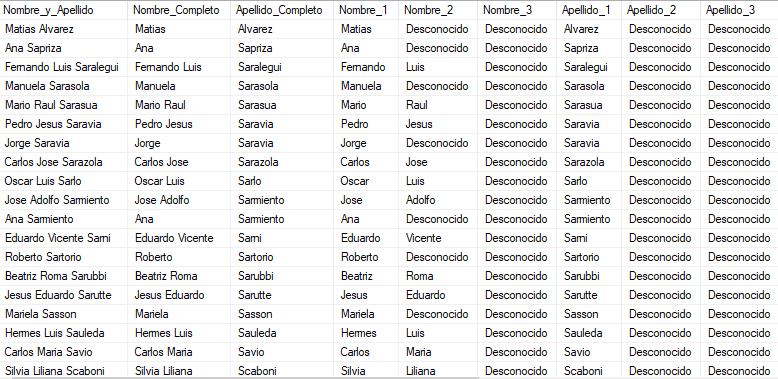 </p> -->
<p align="center">  </p>

[Link Imagen](https://i.ibb.co/rRxqYZX5/ejemplo-desnormalizacion-nombres-de-clientes.png)

6. **Agregación de columnas**
   - Columnas para trazabilidad: IdCliente_Descartado, IdCliente_Correcto.

7. **Verificación final**
   - Renombrado y validación de columnas.

#### **Empleados (ProcessEmployees.py)** 
1. **Carga del dataset**
   - Verificación de columnas: ['ID_empleado', 'Apellido', 'Nombre', 'Sucursal', 'Sector', 'Cargo', 'Salario'].

2. **Aplicación de métodos generales**
   - Relleno de nulos y estandarización de texto.

3. **Almacenamiento de errores**
   - Validación de ID_empleado y Salario (conversión a float).

4. **Desnormalización de sucursales**
   - Extracción del número de sucursal y creación de Sucursal_Completa.

5. **Normalización de cargos**
   - Estandarización de valores en Cargo (por ejemplo: "Adm" => "Administrativo").

6. **Agregación de columnas**
   - Columnas para trazabilidad: IdEmpleado_Descartado, IdEmpleado_Correcto.

7. **Verificación final**
   - Renombrado de columnas (ID_empleado => IdEmpleado).

#### **Gastos (ProcessExpenses.py)**
1. **Carga de datasets**
   - Dataset principal y dataset de feriados.
   - Verificación de columnas: ['IdGasto', 'IdSucursal', 'IdTipoGasto', 'Fecha', 'Monto'].

2. **Aplicación de métodos generales**
   - Relleno de nulos con valores por defecto.

3. **Almacenamiento de errores**
   - Validación de IdGasto, IdSucursal, IdTipoGasto como enteros.

4. **Transformación de fechas**
   - Desnormalización de Fecha en múltiples columnas.

5. **Procesamiento de montos**
   - Detección y corrección de outliers en Monto usando IQR.

6. **Verificación final**
   - Validación de columnas antes de guardar.

> [!NOTE]  
> Gastos y Tipo de Gastos se van a unificar en uno mismo en el área de preparación de la base de datos.  

#### **Ventas (ProcessSales.py)** 
1. **Carga de datasets**
   - Dataset principal y dataset de feriados.
   - Verificación de columnas: ['IdVenta', 'Fecha', 'Fecha_Entrega', 'IdCanal', 'IdCliente', 'IdSucursal', 'IdEmpleado', 'IdProducto', 'Precio', 'Cantidad'].

2. **Aplicación de métodos generales**
   - Relleno de nulos con valores por defecto.

3. **Transformación de fechas**
   - Desnormalización de Fecha y Fecha_Entrega en múltiples columnas.
   - Cálculo de Dias_Entregado.

4. **Procesamiento de precios y cantidades**
   - Corrección de Cantidad (mínimo 1).
   - Detección y corrección de outliers en Precio.
   - Cálculo de Compra_Total.

5. **Verificación final**
   - Validación de columnas antes de guardar.

## **Tests**
El proyecto provee test unitarios y de integración utilizando unittest.    
El mismo podrá ser encontrado en la carpeta "/tests" de la capa de procesamiento en Python.    
La carpeta Test_Dataset provee dataset de pruebas que serán probadas en los distintos test realizados.     
Algunos de estos dataset contienen:  
- Encoding UTF-8 y UTF-16.
- Archivos Excel (simple y multihoja)
- CSV con una columna y varias para testear la detección de separadores
- CSV con distintos separadores (coma, punto y coma, vacío, pipe, etc).

Los test corroboran que todos los métodos funcionan correctamente y están listo para ser usados en el proceso ETL de la capa de procesamiento en Python.

``` bash
.
├── Test_Dataset # Dataset de pruebas
│   ├── Clientes.csv
│   ├── ORIGINAL
│   │   ├── Clientes.csv
│   │   ├── test_encoding_utf16 - copia.csv
│   │   ├── test_encoding_utf16.csv
│   │   ├── test_encoding_utf8.csv
│   │   ├── test_leer_archivo_excel_multihoja.xlsx
│   │   ├── test_leer_archivo_excel_simple.xlsx
│   │   └── test_separadores_coma_utf16.csv
│   ├── test_encoding_utf16.csv
│   ├── test_encoding_utf8.csv
│   ├── test_encoding_utf8.mp3
│   ├── test_leer_archivo_excel_multihoja.xlsx
│   ├── test_leer_archivo_excel_simple.xlsx
│   ├── test_separadores_columna_unica.csv
│   ├── test_separadores_coma.csv
│   ├── test_separadores_coma_utf16.csv
│   ├── test_separadores_especial.csv
│   ├── test_separadores_pipe.csv
│   ├── test_separadores_punto_y_coma.csv
│   ├── test_separadores_separador_inconsistente.csv
│   └── test_separadores_vacio.csv
│ # Scripts para testear los métodos provistos para el procesamiento de los datasets
├── test_ClientMethods.py
├── test_DateMethods.py
├── test_FileUploadTools.py
├── test_GeneralTransformationMethods.py
├── test_IdTransformationMethods.py
├── test_MethodsOutliers.py
├── test_ProductMethods.py
├── test_SupplierMethods.py
└── test_VerificationMethods.py
``` 

Puede ejecutar cualquier test utilizando puede utilizar el siguiente comando
``` bash
   # Opción 1
   $ docker exec -ti airflow_proyecto_matias_alvarez bash -c "python /home/proyecto_matias_alvarez/tests/{NOMBRE_TEST}.py"
   # Opción 2
   $ docker exec -ti airflow_proyecto_matias_alvarez python /home/proyecto_matias_alvarez/tests/{NOMBRE_TEST}.py
``` 

<!-- <p align="center"> 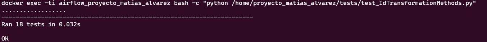 </p> -->
<p align="center">  </p>

[Link Imagen](https://i.ibb.co/1G9Ws6H0/ejemplo-ejecucion-de-test-idtransformationmethods.png)
<p align="center"><em>Ejemplo de ejecución de test_IdTransformationMethods.py</em></p>

## **Capa De Orquestación**
La capa de orquestación es donde se encuentra gran parte de la magia del proyecto.  
Permite a través de Apache Airflow, MySQL y la capa de procesamiento la resolución de la mayor parte de los requisitos del proyecto.  

Me gustaría antes de adentrarnos en la explicación final de esta capa hacer un pequeño resumen de Apache Airflow para sacar un mejor provecho de esta parte, para aquellos que no conocen esta plataforma.     
Si desea, puede saltarlo e ir directamente a [**Script encargado de iniciar Apache Airflow**](#script-encargado-de-iniciar-apache-airflow).   

### **Resumen Teorico Apache Airflow**
Apache Airflow es una plataforma de orquestación de flujos de trabajo diseñada para programar, monitorear y gestionar procesos de datos de manera programática.   
Fue diseñado en Python y lanzado en el año 2014 por AirBnb como código abierto.    
En el año 2016 ingresó al incubator de Apache (que es una previa necesaria al ingreso de un proyecto a la fundación apache -ASF- donde se encarga de adoptar el estilo de gobernanza y operación de Apache y los guía hacia servicios y recursos que pueden usar para convertirse en proyectos ASF de nivel superior) para luego en enero de 2019 convertirse en un proyecto de software de nivel superior de la Fundación Apache.

Utiliza una estructura llamada DAG (Gráfico Acíclico Dirigido) que es una colección de todas las tareas (Task) que se desean ejecutar organizadas de una manera que refleja sus relaciones y dependencias.    
Se definen en un script de Python que representa la estructura del DAG (tareas y sus dependencias) como código.   
Una tarea define una unidad de trabajo dentro de un DAG donde se representa como un nodo en el gráfico DAG y también está escrita en Python.    
Cada tarea es una implementación de un operador, por ejemplo, un PythonOperator para ejecutar algún código Python o un BashOperator para ejecutar un comando Bash.    
La tarea (task) implementa un operador definiendo valores específicos para ese operador, como un comando de Python en el caso de PythonOperator o un comando de Bash en el caso de BashOperator.      
Si bien los DAG describen cómo ejecutar un flujo de trabajo, los Operators determinan qué es lo que realmente hace una tarea.    

Un operador describe una sola tarea en un flujo de trabajo.    
Los operadores suelen ser (aunque no siempre) atómicos, lo que significa que pueden funcionar por sí solos y no necesitan compartir recursos con otros operadores.      
El DAG se asegurará de que los operadores se ejecuten en el orden correcto; salvo estas dependencias, los operadores generalmente se ejecutan de forma independiente. De hecho, pueden ejecutarse en dos máquinas completamente diferentes.    

Este es un punto sutil pero muy importante: en general, si dos operadores necesitan compartir información, como un nombre de archivo o una pequeña cantidad de datos, se debe considerar combinarlos en un solo operador.    
Si es absolutamente necesario, Airflow cuenta con una función para la comunicación entre operadores llamada "XCom" (Cross-Communication).

#### **Operadores**  
Esta es una lista corta de alguno de los operadores que provee Apache Airflow:  
- **BashOperator**: Ejecuta un comando bash.
- **PythonOperator**: Llama a una función arbitraria de Python.
- **EmailOperator**: Envía un correo electrónico.
- **SimpleHttpOperator**: Envía una solicitud HTTP.
- **MySqlOperator, SqliteOperator, PostgresOperator, MsSqlOperator, OracleOperator, JdbcOperator, etc**. : Ejecuta un comando SQL.
- **Sensor**: Operador que espera (sondea) un tiempo determinado, un archivo, una fila de base de datos, una clave S3, etc.
- **ShortCircuitOperator**: Permite implementar lógica condicional. Utiliza una función de Python que devuelve True o False según la lógica implementada para el caso de uso. Si devuelve True , el DAG continúa, caso contrario, se omiten todas las tareas posteriores.
- **Operadores deferrables** (Async): Optimizan recursos usando triggers (Por ejemplo: DeferrableOperator).

#### **Scheduler** 
El Scheduler es un componente central que orquesta la ejecución de los DAGs.    
Su funcionamiento es el siguiente:    
- **Parsing de DAGs**: 
   1. Lee los archivos Python en la carpeta dags/.
   2. Detecta nuevos DAGs o cambios en los existentes.
> [!NOTE]    
> Desde algunas versiones (a partir de 2.0) se realizó la separación de Parsing de DAGs del scheduler para que opere de forma separada y así permitir escalar a miles de tareas.  

- **Creación de DagRuns**:
   1. Determina qué DAGs deben ejecutarse según su schedule_interval.

- **Planificación de Tareas**:
   1. Verifica dependencias (upstream, trigger_rules).
   2. Crea TaskInstances para tareas listas.

- **Encolamiento**:
   1. Envía tareas al Executor (Local, Celery, Kubernetes).

#### **Executors**
Determinan cómo y dónde se ejecutan las tareas.    
Recibe tareas planificadas por el Scheduler, decide el mecanismo para ejecutarlas (local, en cluster, en Kubernetes), gestiona workers y los recursos necesarios.    
Existen varios tipos alguno de esto son:
- **SequentialExecutor**:    
   Es el ejecutor predeterminado.    
   Es el único ejecutor compatible con SQLite ya que este no admite múltiples conexiones.    
   Este ejecutor solo ejecutará una instancia de tarea a la vez.
- **LocalExecutor**: Ejecuta tareas en el mismo servidor que el Scheduler.
- **CeleryExecutor**:  Distribuye tareas en múltiples workers mediante un broker (Redis/RabbitMQ).
- **KubernetesExecutor**: Ejecuta cada tarea en un Pod efímero de Kubernetes.

Puede programarse los propios según la necesidad de cada uno.

#### **Workers**
Llevan a cabo las tareas asignadas por el Executor.    
Contiene las siguiente responsabilidades:    
- Recibir tareas desde el Executor (Celery/Kubernetes).
- Ejecutar el código del Operator (Python, Bash, etc).
- Actualizar el estado en la Metadata Database.
- Gestionar recursos locales (CPU, memoria).

#### **Estados de una Tarea**  
Las tareas pueden pasar por varios estados durante su ciclo de vida. Estos son algunos de los estados posibles:     
- **None**:    
   Es el estado inicial antes de que la tarea sea programada o asignada a un ejecutor.    
   También puede aparecer cuando una tarea ha sido limpiada (cleared) y está esperando a ser reprogramada.
- **scheduled**:    
   La tarea ha sido programada para ejecutarse pero aún no ha sido asignada a un worker.    
   Airflow determina cuándo debe ejecutarse según la planificación (DAG schedule).
- **queued**:   
   La tarea ha sido asignada a un worker pero está esperando recursos (por ejemplo, un slot libre en el ejecutor).     
   Depende del pool y la concurrencia configurados.
- **running**:   
   La tarea está siendo ejecutada activamente por un worker.      
   Airflow actualiza este estado cuando el worker recoge la tarea y comienza a procesar.  
- **success**:    
   La tarea se completó exitosamente sin errores.   
   Si todas las tareas del DAG terminan en success, el DAG también se marca como success.
- **failed**:   
   La tarea falló durante la ejecución (por una excepción, timeout, etc).   
   Dependiendo de la configuración (retries), Airflow puede reintentar.
- **skipped**:    
   La tarea fue omitida debido a una condición (por ejemplo, un BranchPythonOperator decidió saltarla).    
   No se considera un fallo, simplemente no era necesaria su ejecución.
- **up_for_retry**:    
   La tarea falló pero tiene reintentos (retries) configurados y está esperando para volver a ejecutarse.    
   El próximo intento se programa según retry_delay.
- **upstream_failed**:    
   La tarea no se ejecutó porque una tarea dependiente upstream (anterior) falló.    
   Airflow evita ejecutarla porque no tiene sentido sin sus dependencias.
- **restarting**:    
   Estado temporal durante el reinicio del executor o worker.    
   Indica que la tarea podría volver a encolarse pronto.

#### **Triggers Rules**  
Los triggers rules (reglas de activación o de dependencia) son reglas que determinan cuándo se activará una tarea después de que sus tareas dependientes hayan terminado su ejecución.    
- **all_success**: La tarea se ejecuta solo cuando todas las tareas ascendentes se han realizado correctamente.
- **all_failed**: La tarea se ejecuta únicamente cuando todas las tareas ascendentes están en estado fallido o upstream_failed.
- **all_done**: La tarea se ejecuta una vez que todas las tareas ascendentes han finalizado su ejecución.
- **all_skipped**: La tarea se ejecuta solo cuando se han omitido todas las tareas anteriores.
- **one_failed**: La tarea se ejecuta cuando al menos una tarea ascendente ha fallado.
- **one_success**: La tarea se ejecuta cuando al menos una tarea ascendente ha tenido éxito.
- **one_done**: La tarea se ejecuta cuando al menos una tarea ascendente ha tenido éxito o ha fallado.
- **none_failed**: La tarea se ejecuta únicamente cuando todas las tareas anteriores se han realizado correctamente o se han omitido.
- **none_failed_min_one_success**: La tarea se ejecuta solo cuando todas las tareas ascendentes no han fallado o upstream_failed, y al menos una tarea ascendente ha tenido éxito.
- **none_skipped**: La tarea se ejecuta únicamente cuando ninguna tarea ascendente se encuentra en estado omitido.
- **always**: La tarea se ejecuta en cualquier momento.
- **Casos especiales**: 
   - **Branching**:    
      El decorador @task.branch o BranchPythonOperator permiten usar lógica personalizada para decidir cuáles de un conjunto de tareas posteriores deben ejecutarse a continuación y cuáles deben omitirse.    
      Es importante ajustar las reglas de activación posteriores para permitir la omisión de tareas anteriores.
   - **fail_stop**:     
      Puede definir un DAG que detenga su ejecución ante cualquier fallo de tarea estableciendo el parámetro DAG fail_stop en True.    
      Esto establecerá todas las tareas en ejecución en failed y marcará las que aún no se hayan ejecutado como skipped.    
      En un DAG que use fail_stop, no puede tener reglas de activación distintas de all_success.

#### **Base de datos de metadatos**  
Es una base de datos SQL (que puede ser PostgreSQL, MySQL o SQLite) que almacena toda la información de estado, configuraciones y logs de Airflow. Por defecto utiliza SQLite3.    
Almacena las definiciones de los dags y su historial de ejecución, las tareas y los estados de las mismas, configuraciones varias como conexiones a sistemas externos (por ejemplo para nuestro caso se crearon 3 conexiones a MSSQL) y variables, comunicaciones entre tareas (a través de XCOM), registros de ejecución, etc.    
Permite rastrear ejecuciones pasadas y depurar fallos para realizar seguimientos y auditorías.   
Utilizar una base de datos de metadatos distinta a SQLite es de gran importancia ya que permite cambiar el tipo de Executor a utilizar (por ejemplo a LocalExecutor, CeleryExecutor, etc) como centralizar la información para schedulers y workers para alta escalabilidad (con más sentido en clusters distribuidos).     
En el proyecto se optó por utilizar MySQL.         

> [!NOTE]  
> Inicialmente pensé en utilizar MSSQL para crear la base de datos de metadata y "ahorrar" el tener que crear un recurso que solo fuera utilizado como base de datos de metadata.   
> Si bien en un entorno real esto no tiene sentido ya que se estaría utilizando de una forma incorrecta y gastando recursos que se deberían utilizar únicamente en el modelo dimensional para el proyecto hubiera sido una simplificación.     
> Revisando la documentación de Apache Airflow me encontré que MSSQL fue despreciado como base de datos con este fin, así que opte por utilizar MySQL por un tema de eficiencia de lecturas, ser más liviano y gestionar la memoria de una forma eficiente para lo que se necesita.    
> Si en mi caso de uso hubiera sido la escalabilidad uno de los ejes principales hubiera utilizado PostgreSQL ya que está diseñado para manejar cargas de trabajo pesadas y grandes volúmenes de datos.


### **Script encargado de iniciar Apache Airflow**
Se utiliza un script bash para gestionar de forma correcta la creación, configuración e iniciación de Apache Airflow.     
Esto es necesario ya que para construir los servicios se utiliza el comando: "docker compose up --build --no-start" y dado que MySQL fue definido para construirse en un contenedor separado en vez de definirse dentro del DockerFile de Airflow genera el siguiente problema: Al momento de intentar crear la base de datos de los metadatos esta falla ya que no logra comunicarse con MySQL.       
Entonces, cuando se intenta iniciar el contendor de Airflow este se cierra luego de tres segundos mostrando un mensaje (en los logs del contendor) de que no se pudo conectar a MySQL (aunque MySQL y Apache Airflow hayan sido iniciados en el orden correcto nuevamente).    

Para solucionar esto se desarrolló la siguiente solución:  
``` bash
   data_services/airflow/scripts
   ├── conf.dat
   └── iniciar_airflow.sh
``` 
El archivo conf.dat se encarga de proveer el estado de Airflow: [CONFIGURAR, INICIAR_AIRFLOW].  
La carpeta entera se carga al contenedor al momento de la creación del mismo.  

Por ejemplo si realizara un cat sobre conf.dat vería algo como esto:   
``` bash
# [Un explicativo del archivo...]

## Estado del contenedor -> Posibles valores: [CONFIGURAR, INICIAR_AIRFLOW]
ESTADO_DEL_CONTENEDOR=CONFIGURAR
``` 
Esta propiedad es de utilidad al momento de ejecutar el script iniciar_airflow.sh en el contenedor.    
El flujo de ejecución y lógica del mismo es la siguiente:   
1. **Configuración Inicial**
   - Determina el directorio del script y carga el archivo de configuración (conf.dat).
   - Localiza el binario de Airflow en el sistema.

2. **Verificación de Estado**
   - Lee la variable ESTADO_DEL_CONTENEDOR del archivo de configuración.
   - Ejecuta diferentes bloques según el valor de esta variable.

3. **Bloque CONFIGURAR (Primera Ejecución)**
   - Verifica que el comando airflow esté disponible.
   - Inicializa la base de datos de Airflow (airflow db init).
   - Crea un usuario administrador de Airflow.
   - Establece tres conexiones a MSSQL con diferentes credenciales y propósitos:
     - **MSSQL_CONN** : Para área de preparación y modelo.
     - **MSSQL_CONN_COMM** :Para comunicación entre servicios.
     - **MSSQL_CONN_VER** : Para verificación de bases de datos.
     <!-- <p align="left"> 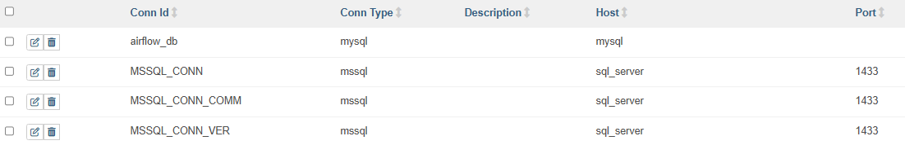 </p> -->
     <p align="left">  </p>

     [Link Imagen](https://i.ibb.co/pvqPzHtV/lista-conexiones-creadas-apache-airflow.png)

   - Actualiza el estado a INICIAR_AIRFLOW en el archivo de configuración

4. **Bloque INICIAR_AIRFLOW**
   - Mata cualquier proceso de Airflow existente (útil cuando se apaga y vuelve a iniciar el contenedor).
   - Inicia los binarios necesarios de Airflow en segundo plano.

5. **Mantener el Contenedor Activo**
   - Ejecuta tail -f /dev/null para mantener el contenedor en ejecución.

Si ahora hiciera un cat al conf.dat dentro del contenedor (/home/proyecto_matias_alvarez/scripts/conf.dat) vería algo como esto:

``` bash
ESTADO_DEL_CONTENEDOR=INICIAR_AIRFLOW
``` 

### **Utilidades para los DAGs**
Para lograr el correcto funcionamiento de los DAGs existen dos carpetas necesarias:
   - ErrorTypes: Donde se definen los errores posibles de los DAGs.
   - utils: Contiene un Script python que modulariza ciertos métodos necesarios.

``` bash
   data_services/airflow/dags
   ├── ErrorTypes
   │   └── ErrorTypes.py
   └── utils
      └── utils.py
``` 

Por ejemplo utils.py puede proveer los siguientes métodos:
 - **__obtener_base_de_datos(env:str='DATABASE_SQL')** Se obtiene el nombre de la base de datos a través de una variable de entorno.
 - **_enviar_mensaje_mssql(mensaje:str, \**kwargs)**: Permite enviar un mensaje al contenedor de SQL Server. Es el encargado de comunicarse con el Listener de MSSQL.

También provee la siguiente variable:
   - **default_args**: Diccionario con las claves y valores necesarios para todos los DAGs.

### **DAGs Del Proyecto**
Se proveen de 5 DAGs para el proyecto:
1. **procesamiento_y_carga_all_dataset**: Procesamiento capa Python. 
2. **procesamiento_area_preparacion**: Procesamiento del área de preparación en MSSQL.
3. **carga_modelo_dimensional**: Carga al Modelo Dimensional luego de haber procesado el área de preparación.
4. **procesamiento_area_preparacion_y_carga_modelo_dimensional**: Procesa el área de preparación y carga el modelo.
5. **proceso_completo_del_proyecto**: Ejecuta el DAG 1 y el DAG 4.

La idea de proveer los DAGs de esta forma es permitir al usuario que pueda procesar un DAG y ver el resultado en vez de utilizar el DAG Maestro que genera todo el proceso completo de procesamiento y orquestación del proyecto.     
Por ejemplo, puede ejecutar el DAG "procesamiento_y_carga_all_dataset" y observar cómo llega al área de preparación, luego ejecutar "procesamiento_area_preparacion" para ver como se actualizaron los datos en el las tablas temporales y las tablas auxiliares (tbl_errores) y así sucesivamente.
Otro objetivo de realizarlo de esta forma es que puede encontrar de forma más sencilla los errores en caso de que sucedan.     
Por ejemplo, el dag maestro en sí contiene 4 tareas donde se utiliza el operador TriggerDagRunOperator para ejecutar ciertos DAGs, de esta forma si algún DAG falla realmente no vemos de forma rápida que falló sino que deberíamos buscar en los LOGs para detectar cuando, que y como falló cierta tarea.

### **Explicación de los DAGs**
La explicación individual de los objetivos y tarea de los DAGs es la siguiente:
1. **procesamiento_y_carga_all_dataset**:   
   El objetvo es procesar todos los datasets en Python y cargarlos al área de preparación en SQL Server.  
   Contiene dos grupos principales "process" y "load" que se encargan de procesar los dataset y de cargarlo a la base de datos, respectivamente.
   Las tareas son:

   - **Grupo process**:
      - **process_product_type_task** 
      - **process_product_task** 
      - **process_supplier_task** 
      - **process_purchase_task** 
      - **process_branches_task** 
      - **process_expense_type_task** 
      - **process_expenses_task** 
      - **process_sales_channel_task** 
      - **process_customers_task** 
      - **process_employees_task** 
      - **process_sales_task** 

   - **Grupo load**:
      - **load_product_type_task** 
      - **load_product_task** 
      - **load_supplier_task** 
      - **load_purchase_task** 
      - **load_branches_task** 
      - **load_expense_type_task** 
      - **load_expenses_task** 
      - **load_sales_channel_task** 
      - **load_customers_task** 
      - **load_employees_task** 
      - **load_sales_task** 

   Además contiene tareas que simplemente se utilizan como marcador de inicio y final de ciertas etapas (usando EmptyOperatos).

   <!-- <p align="center"> 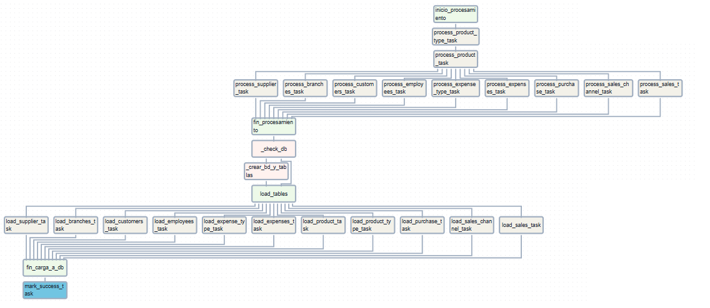 </p> -->
   <p align="center">  </p>

   [Link Imagen](https://i.ibb.co/cXcpSv2t/DAG-procesamiento-y-carga-all-dataset.png)

   Los operadores utilizados son:   
   - **BashOperator**: Ejecuta scripts Python para procesamiento y carga.
   - **EmptyOperator**: Marca puntos de control (inicio/fin).
   - **BranchPythonOperator** (como task decorator): Decide si crear DB o cargar datos.
   - **ExternalTaskMarker**: Señala finalización a DAGs dependientes.
   - Las Triggers Rules son las siguientes:
      - **all_success** para finalización de procesamiento.
      - **one_success** para bifurcación DB.
      - **all_done** para finalización de carga.

   Por último el flujo de ejecución es el siguiente:
   ``` 
   Inicio con inicio_procesamiento (EmptyOperator) ->
   Procesamiento secuencial de tipos de producto -> productos
   Procesamiento paralelo de otros datasets ->
   Verificación de infraestructura SQL Server:
      1. Si no existe DB: _crear_bd_y_tablas
      2. Si existe: carga directa
   -> 
   Carga paralela a tablas temporales ->
   Finalización con mark_success_task
   ``` 

   Como se puede notar gracias a BranchPythonOperator se verifica si existe la base de datos a través del método utils._enviar_mensaje_mssql() que se encarga de comunicarse con el Listener.py de MSSQL.


2. **procesamiento_area_preparacion**     
   El objetivo es validar y transformar los datos del área de preparación a un formato apto para el modelo dimensional.   
   Las tareas son:   
      - **start_task** 
      - **processing_task** 
      - **end_task** 
      
   <!-- <p align="center"> 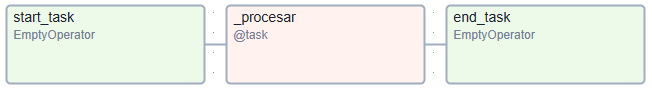 </p> -->
   <p align="center">  </p>

   [Link Imagen](https://i.ibb.co/8LyYz2mf/DAG-procesamiento-area-preparacion.png)

   Operadores Utilizados:
   - **EmptyOperator**: Puntos de control.
   - **PythonOperator**: Envía la solicitud de evento a SQL Server para el procesamiento del área de preparación.

   Flujo de Ejecución:
   ``` 
      Inicio con start_task ->
      Ejecución de _procesar() que envía mensaje a SQL Server ->
      Finalización con end_task
   ``` 

3. **carga_modelo_dimensional**
   El objetivo es cargar los datos procesados del área de preparación al modelo dimensional.

   Las tareas son:
     - **start_task** 
     - **load_dimensional_model_task** 
      - **end_task** 

   <!-- <p align="center"> 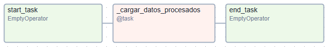 </p> -->
   <p align="center">  </p>

   [Link Imagen](https://i.ibb.co/pvmCjGhX/DAG-carga-modelo-dimensional.png)

   Operadores Utilizados:
   - **EmptyOperator**: Puntos de control.
   - **PythonOperator**: Envía la solicitud de evento a SQL Server para la carga al modelo dimensional.

4. **procesamiento_area_preparacion_y_carga_modelo_dimensional**
   El objetivo es la ejecución secuencial del DAG 2 y 3.
   Las tareas son:
      - **start_task**
      - **processing_load_task**
      - **end_task**

   <!-- <p align="center"> 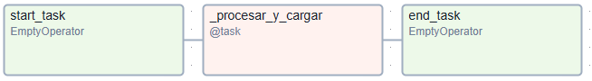 </p> -->
   <p align="center">  </p>

   [Link Imagen](https://i.ibb.co/dJVFmRZL/DAG-procesamiento-area-preparacion-y-carga-modelo-dimensional.png)

5. **proceso_completo_del_proyecto**
   El objetivo es coordinar la ejecución secuencial de todos los DAGs.

   Las tareas son:
      - start_task_maestro 
      - trigger_procesamiento 
      - trigger_procesamiento_completo 
      - end_task_maestro 

   <!-- <p align="center">  </p> -->
   <p align="center">  </p>

   [Link Imagen](https://i.ibb.co/yngwTcjc/DAG-proceso-completo-del-proyecto.png)

   Los operadores utilizados son:
   - **EmptyOperator**
   - **TriggerDagRunOperator**

> [!TIP]  
> El operador TriggerDagRunOperator permite ejecutar y esperar el resultado de un DAG definido.

   El flujo es el siguiente:
   ``` 
      Ejecuta DAG 1 (procesamiento Python) ->
      Al completarse, ejecuta DAG 4 (Procesamiento al área de procesamiento y carga al modelo dimensional) ->
      Finaliza todo el proceso

   En caso de falla de algún DAG no se sigue el proceso.
   ``` 

Al finalizar la ejecución del proceso para el proyecto obtenemos: 
   - **Consistencia de datos**.
   - **Trazabilidad de errores**.
   - **Integridad referencial**.
   - **Modelo dimensional apto para generar insights de alta calidad**.

El diseño de los DAGs provisto ofrece:
   - **Modularidad**: Cada etapa del proceso en DAGs separados
   - **Reutilización**: DAG 4 combina funcionalidad de DAGs 2 y 3
   - **Control de Errores**:
     - **Retries configurados en default_args**
     - **Validación de resultados en tareas Python**
   - **Escalabilidad**:
     - **Procesamiento paralelo donde es posible**
     - **Código independiente por dataset**  

#### **Ejecución del DAG**
Tiene tres formas de ejecutar los DAGs
- Desde la WebUI de forma manual.
- Usando la API provista por Apache Airflow.
- Utilizando el Gestor del proyecto.

## **Capa de Almacenamiento**
En esta sección se explica toda la implementación de las bases de datos necesarias para el proyecto.     
Recordar que todos los scripts se encuentran en la carpeta data_services/mssql/scripts.     
Todo el proceso es automatizado al momento de crearse el contendor de SQL Server gracias al Dockerfile generado para el servicio que ejecuta los procesos necesarios junto a la ejecución de scripts bash y sql.   

Las bases de datos desarrolladas del proyecto son:
- **proyecto_matias_alvarez**:       
   Es el almacén de datos.   
   Engloba el área de preparación, modelo dimensional y tablas auxiliares.     
   Contiene Triggers, procedimientos almacenados y un conjunto de usuarios necesarios para los servicios Apache Airflow y Apache Superset. 
- **comunication_db**:      
   Base de datos encargada de gestionar los mensajes de comunicación entre servicios (Apache Airflow y MSSQL).     
   Contiene la tabla "mensajes" y un usuario llamado "com_user" con privilegios de inserción y lectura sobre la tabla mensajes.


### **Comunicación Entre Servicios**
Como se mencionó el Script Listener.py se ejecuta en el contenedor de MSSQL donde constantemente está escuchando las peticiones de Apache Airflow.

La base de datos para este proceso se llama "comunication_db" y contiene una tabla llamada "mensajes" que está definida con el siguiente esquema:
``` sql
   id BIGINT IDENTITY PRIMARY KEY,
   CID VARCHAR(36) NOT NULL, 
   mensaje VARCHAR(50) NOT NULL,  
   emisor VARCHAR(50) NOT NULL,
   receptor VARCHAR(50) NOT NULL,
   fecha_creacion DATETIME2 DEFAULT SYSDATETIME(),
   estado VARCHAR(20) NOT NULL, 
   resultado NVARCHAR(16)    
``` 

Donde:
   - **id**: Hace referencia al ID del registro.
   - **CID**: Es un UUID4 que permite correlacionar una solicitud-respuesta.
   - **mensaje**: Mensaje a procesar el mismo puede ser:
      - **"crear_db"**: Pide que se cree la base de datos y todo lo relacionado a la misma (tablas[área de preparación y modelo dimensional], triggers, procedimientos, usuarios, etc).
      - **"iniciar_modelo"**: Cargar el modelo dimensional con los datos del área de preparación.
      - **"cerrar_listener"**: Cerrar el Listener.
      - **"procesar_area_procesamiento"**: Procesar el área de preparación.
      - **"procesar_y_iniciar_modelo"**: Procesar el área de preparación y cargar el modelo dimensional.
   - **emisor**: Quien envía el mensaje. Para nuestro caso de uso siempre será Airflow o MSSQL.
   - **receptor**: Quien recibe el mensaje. Para nuestro caso de uso siempre será Airflow o MSSQL. 
   - **fecha_creacion**: Fecha de creación de la petición/mensaje.
   - **estado**: Estado del mensaje. Puede ser:
      - **pendiente**: La solicitud todavía no fue procesada.
      - **procesado**: La solicitud ya fue procesada.
   - **resultado**: Resultado de la petición.
      - **OK**: Se procesó con éxito la solicitud.
      - **ALREADY DONE**: La solicitud ya fue resuelta anteriormente.
      - **FAIL**: La solicitud falló.

Todo este proceso está definido en el script SQL $DIR_PROYECTO/data_services/mssql/scripts/SQL/comunicacion_entre_servicios/DDL_y_user.sql.     
La base de datos y sus necesidades son creadas en el contenedor MSSQL al momento de crearse el mismo bajo el script "$DIR_PROYECTO/data_services/mssql/scripts/bash/crear_db_para_eventos.sh" que es ejecutado desde el DockerFile.

<!-- <p align="center"> 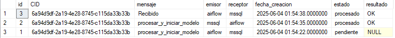 </p> -->
<p align="center">  </p>

[Link Imagen](https://i.ibb.co/8g7DgN21/tabla-mensajes-comunication-db.png)

## **Data Warehouse**

### **Tablas auxiliares**
Se crean tablas auxiliares que ayudan en la transformación de los datos del área de preparación y en la gestión de los datos.      

Las tablas auxiliares son:   
- **tbl_errores** : Tabla que almacena los errores encontrados en las tablas del área de preparación.
<!-- <p align="center"> 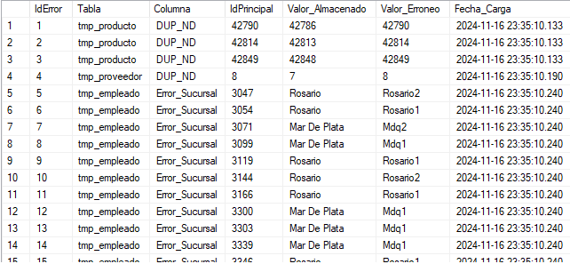 </p> -->
<p align="center">  </p>

[Link Imagen](https://i.ibb.co/hJzdfJcB/ejemplo-tabla-errores.png)
<p align="center"><em>Ejemplo tabla tbl_errores luego de procesar el área de preparación.</em></p>

- **feriados**: Tabla que almacena las fechas que fueron feriados desde el año 2015 a 2024.
<!-- <p align="center">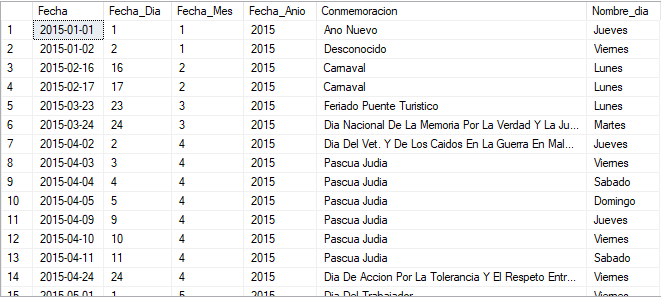 </p> -->
<p align="center"> </p>

[Link Imagen](https://i.ibb.co/DHtDhdmY/ejemplo-tabla-feriados.png)
<p align="center"><em>Ejemplo tabla feriados.</em></p>

- **max_ids**:    
   Tabla que almacena el máximo ID de cada tabla de dimensión y hecho.  
   Se utiliza para aquellos casos cuando se tiene ID Desconocidos de alguna tabla y debe actualizarse con un nuevo ID válido.    
   En ese caso se utiliza el valor de la columna pertinente aumentado en 1 y luego se almacena este nuevo valor en la columna pertinente.    
   La tabla max_ids se actualiza automáticamente cada vez que se inserta algún elemento en la tabla de de dimensión o de hecho (si resulta que el ID insertado es mayor que el ID que se tiene almacenado).
   <!-- <p align="center">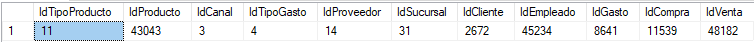</p> -->
   <p align="center"><em>Ejemplo tabla max_ids luego de procesar el área de preparación y hacer la carga al modelo dimensional.</em></p>
   <p align="center"></p>

   [Link Imagen](https://i.ibb.co/XkK9Dm89/ejemplo-tabla-max-ids.png)

### **Área de Preparación**   
Antes de cargar los datos en el modelo dimensional, los datos se almacenan en tablas temporales (que utilizan el formato tmp_{nombre_tabla}), donde se aplican las últimas transformaciones pertinentes y se gestionan errores.

- **tmp_tipo_producto** 
- **tmp_producto** 
- **tmp_canal_venta** 
- **tmp_tipo_gasto** 
- **tmp_proveedor**
- **tmp_sucursal** 
- **tmp_cliente** 
- **tmp_empleado**
- **tmp_gasto** 
- **tmp_compra** 
- **tmp_venta** 

Para dar un ejemplo de esquema la tabla tmp_tipo_producto es el siguiente:   
``` sql
CREATE TABLE tmp_tipo_producto(
   IdTipoProducto INT,
   TipoProducto NVARCHAR(255),
   IdTipoProducto_Actualizado BIT,
   IdTipoProducto_Descartado BIT DEFAULT 0, 
   IdTipoProducto_Correcto INT DEFAULT -1,
   Error_IdTipoProducto NVARCHAR(255),
   Error_TipoProducto NVARCHAR(255),
   TipoProducto_Descartado NVARCHAR(255)
);
``` 
### **Modelo Dimensional**  
El modelo dimensional se organiza en un Esquema en Estrella, es decir, que las tablas de hechos visualmente estarán rodeadas de tablas de dimensiones.   

- **Tablas de Hechos**

   - **fact_gastos**: Almacena los registros de gastos (no relacionados a productos) de las distintas sucursales: Contiene enlaces a las dimensiones de fecha, sucursal y tipo de gasto.
      ``` sql
      CREATE TABLE Fact_Gastos (
         GastoSK INT PRIMARY KEY IDENTITY(1,1), 
         IdGasto INT,
         SucursalSK INT,
         IdFecha INT,
         IdTipoGasto INT,
         TipoGasto NVARCHAR(50) DEFAULT 'Desconocido',
         Monto FLOAT DEFAULT -1 CHECK (Monto >= -1), 
         Outlier BIT,
         FOREIGN KEY (SucursalSK) REFERENCES Dim_Sucursal(SucursalSK),
         FOREIGN KEY (IdFecha) REFERENCES Dim_Fecha(IdFecha)
      );
      ``` 
   - **fact_compras**: Contiene registros de compras (de productos) para las sucursales, vinculados con dimensiones de fecha, producto, y proveedor.
      ``` sql
      CREATE TABLE Fact_Compras (
         CompraSK INT PRIMARY KEY IDENTITY(1,1), 
         IdCompra INT,
         ProductoSK INT,
         ProveedorSK INT,
         IdFecha INT,
         Cantidad INT DEFAULT 1 CHECK (Cantidad >= 1), -- Como mínimo solo puede haber una cantidad de 1
         Precio FLOAT DEFAULT -1 CHECK (Precio >= -1),
         Compra_Total FLOAT DEFAULT -1, 
         Outlier BIT,  
         FOREIGN KEY (ProductoSK) REFERENCES Dim_Producto(ProductoSK),
         FOREIGN KEY (ProveedorSK) REFERENCES Dim_Proveedor(ProveedorSK),
         FOREIGN KEY (IdFecha) REFERENCES Dim_Fecha(IdFecha)
      );
      ``` 
   - **fact_ventas**: Registra todas las ventas realizadas (de productos), incluyendo detalles de cliente, canal de venta, empleado y sucursal y fechas de venta y entrega.
      ``` sql
      CREATE TABLE Fact_Ventas (
         VentaSK INT PRIMARY KEY IDENTITY(1,1), 
         IdVenta INT,
         ClienteSK INT,
         SucursalSK INT,
         EmpleadoSK INT,
         ProductoSK INT,
         IdFecha_Venta INT,
         IdFecha_Entrega INT,
         Dias_Entregado INT DEFAULT -1,
         Precio  FLOAT DEFAULT -1 CHECK (Precio >= -1), 
         Cantidad INT DEFAULT 1 CHECK (Cantidad >= 1),
         Compra_Total FLOAT DEFAULT -1 ,
         Outlier BIT,
         IdCanal INT,
         Tipo_Canal NVARCHAR(50) DEFAULT 'Desconocido',
         FOREIGN KEY (ClienteSK) REFERENCES Dim_Cliente(ClienteSK),
         FOREIGN KEY (SucursalSK) REFERENCES Dim_Sucursal(SucursalSK),
         FOREIGN KEY (EmpleadoSK) REFERENCES Dim_Empleado(EmpleadoSK),
         FOREIGN KEY (ProductoSK) REFERENCES Dim_Producto(ProductoSK),
         FOREIGN KEY (IdFecha_Venta) REFERENCES Dim_Fecha(IdFecha),
         FOREIGN KEY (IdFecha_Entrega) REFERENCES Dim_Fecha(IdFecha)
      );
      ``` 
- **Tablas de Dimensiones**

   - **dim_clientes**: Detalles de cada cliente.
      ``` sql
      CREATE TABLE Dim_Cliente (
         ClienteSK INT PRIMARY KEY IDENTITY(1,1), 
         IdCliente INT,
         Nombre_y_Apellido NVARCHAR(255) DEFAULT 'Desconocido',
         Nombre_Completo NVARCHAR(255),
         Apellido_Completo NVARCHAR(255),
         Nombre_1 NVARCHAR(255),
         Nombre_2 NVARCHAR(255),
         Nombre_3 NVARCHAR(255),
         Apellido_1 NVARCHAR(255),
         Apellido_2 NVARCHAR(255),
         Apellido_3 NVARCHAR(255),
         Edad INT DEFAULT -1 CHECK (Edad >= -1),
         Grupo_Etario NVARCHAR(12) DEFAULT 'Desconocido',
         Mayor_Edad BIT,
         Domicilio NVARCHAR(255) DEFAULT 'Desconocido',
         Provincia NVARCHAR(255) DEFAULT 'Desconocido',
         Localidad NVARCHAR(255) DEFAULT 'Desconocido',
         Latitud NVARCHAR(12) DEFAULT '-1',
         Longitud NVARCHAR(12) DEFAULT '-1',
         Alta DATETIME NOT NULL,
         Baja DATETIME DEFAULT '9999-12-31 23:59:59',
         Version_Actual BIT NOT NULL
      );
      ``` 
   - **dim_empleado**: Información de los empleados.
      ``` sql
      CREATE TABLE Dim_Empleado (
         EmpleadoSK INT PRIMARY KEY IDENTITY(1,1), 
         IdEmpleado INT,
         Nombre_y_Apellido NVARCHAR(255) DEFAULT 'Desconocido',
         Apellido NVARCHAR(125) DEFAULT 'Desconocido',
         Nombre NVARCHAR(130) DEFAULT 'Desconocido',
         Sucursal_Completa NVARCHAR(255) DEFAULT 'Desconocido',
         Sucursal NVARCHAR(255) DEFAULT 'Desconocido',
         Numero_Sucursal TINYINT DEFAULT -1,
         Sector NVARCHAR(125) DEFAULT 'Desconocido',
         Cargo NVARCHAR(125) DEFAULT 'Desconocido',
         Salario FLOAT DEFAULT -1,
         Sigue_Trabajando BIT NOT NULL,
         Alta DATETIME NOT NULL,
         Baja DATETIME DEFAULT '9999-12-31 23:59:59',
         Version_Actual BIT NOT NULL
      );
      ``` 
   - **dim_producto**: Datos de los productos.
      ``` sql
      CREATE TABLE Dim_Producto (
         ProductoSK INT PRIMARY KEY IDENTITY(1,1), 
         IdProducto INT NOT NULL,
         IdTipoProducto INT NOT NULL,
         Producto NVARCHAR(255) DEFAULT 'Desconocido',
         TipoProducto NVARCHAR(255) DEFAULT 'Desconocido',
         Marca NVARCHAR(255),
         Modelo NVARCHAR(255),
         Componente NVARCHAR(255),
         Precio FLOAT CHECK (Precio >= -1),
         Producto_Descartado BIT NOT NULL,
         Alta DATETIME NOT NULL,
         Baja DATETIME DEFAULT '9999-12-31 23:59:59',
         Version_Actual BIT NOT NULL
      );
      ``` 
   - **dim_proveedor**: Información sobre los proveedores.
      ``` sql
      CREATE TABLE Dim_Proveedor (
         ProveedorSK INT PRIMARY KEY IDENTITY(1,1), 
         IdProveedor INT,
         Sociedad_Completa NVARCHAR(100) DEFAULT 'Desconocido',
         Nombre NVARCHAR(255) DEFAULT 'Desconocido',
         Tipo_Sociedad NVARCHAR(11) DEFAULT 'Desconocido',
         Direccion NVARCHAR(255) DEFAULT 'Desconocido',
         Ciudad NVARCHAR(255) DEFAULT 'Desconocido',
         Provincia NVARCHAR(255) DEFAULT 'Desconocido',
         Pais NVARCHAR(255) DEFAULT 'Desconocido',
         Departamento NVARCHAR(255) DEFAULT 'Desconocido',
         Alta DATETIME NOT NULL,
         Baja DATETIME DEFAULT '9999-12-31 23:59:59',
         Version_Actual BIT NOT NULL
      );
      ``` 
   - **dim_sucursal**: Datos de cada sucursal.
      ``` sql
      CREATE TABLE Dim_Sucursal (
         SucursalSK INT PRIMARY KEY IDENTITY(1,1), 
         IdSucursal INT,
         Sucursal NVARCHAR(255) DEFAULT 'Desconocido',
         Numero_Sucursal TINYINT DEFAULT -1,
         Sucursal_Completa NVARCHAR(255) DEFAULT 'Desconocido',
         Direccion NVARCHAR(255) DEFAULT 'Desconocido',
         Localidad NVARCHAR(255) DEFAULT 'Desconocido',
         Provincia NVARCHAR(255) DEFAULT 'Desconocido',
         Latitud NVARCHAR(12) DEFAULT '-1',
         Longitud NVARCHAR(12) DEFAULT '-1',
         Alta DATETIME NOT NULL,
         Baja DATETIME DEFAULT '9999-12-31 23:59:59',
         Version_Actual BIT NOT NULL
      );
      ``` 
   - **dim_fecha**: Estructura temporal con detalles de fechas que permite realizar análisis por día, mes, trimestre, etc.
      ``` sql
      CREATE TABLE Dim_Fecha (
         IdFecha INT PRIMARY KEY,  -- AAAAMMDD
         Fecha DATE,
         Dia SMALLINT DEFAULT -1,
         Mes SMALLINT DEFAULT -1,
         Anio INT,
         Nombre_Dia NVARCHAR(11) DEFAULT 'Desconocido',
         Numero_Dia_Semana NVARCHAR(11) DEFAULT 'Desconocido',
         Nombre_Mes NVARCHAR(11) DEFAULT 'Desconocido',
         Num_Semana_Anio SMALLINT DEFAULT -1,
         Periodo INT DEFAULT 999912,
         Trimestre SMALLINT DEFAULT -1,
         Feriado BIT DEFAULT 0 
      );
      ``` 

> [!IMPORTANT]  
> (1) Cada tabla de dimensión (a excepción de Dim_Fecha) incluye un sistema de control de cambios de tipo SCD 2, lo que permite realizar un seguimiento de los cambios históricos en los datos.    
> (2) Recuerde que según como quiere analizar los datos debe tener en cuenta los filtros para campos descartados, detectados (y solucionados) como outliers, etc para generar mejores análisis.   

### **Procedimientos Almacenados**

Se desarrollarán procedimientos almacenados en SQL Server para realizar transformaciones avanzadas en el área de preparación, como unificación de valores, actualización de IDs y cálculos de fechas.     
Estos procedimientos son:     
1. **actualizar_ids_desconocidos**(@nombre_tabla, @nombre_columna):    
   Actualiza los registros con un valor de ID desconocido (-1) en una tabla dada, asignándoles valores secuenciales a partir del máximo ID encontrado en una tabla auxiliar max_ids y la tabla temporal (en casos de futuras cargas ya que pueden aparecer otros IDs mayores a los conocidos), y luego actualiza dicha tabla para reflejar el nuevo valor máximo.     
   Utiliza un cursor para recorrer los registros con ID desconocido y actualizarlos, incrementando el ID asignado a medida que avanza.     
2. **aplicar_title_una_palabra**(@nombre_tabla, @nombre_columna):     
   Aplica mayúscula al primer carácter de una palabra en una tabla y columna especificada.    
3. **actualizar_id_de_dup_nd**(@tabla_hecho, @tabla_dim, @columna_id):     
   Actualiza la tabla de hecho el ID correspondiente a duplicado no directo de la tabla de dimensión pasada.   
4. **marcar_outliers** : Marca en las tablas tmp_gasto, tmp_venta y tmp_compra aquellos valores que parecen ser outliers.   
5. **procesar_dup_nd_{nombre_tabla}** : Encuentra los duplicados no directos y actualiza los campos '{nombre_tabla}_Descartado' y '{nombre_tabla}_Correcto' según corresponda.

> [!NOTE]    
> Algunos procedimientos realmente no son necesarios dado que se realiza en la capa de procesamiento pero en caso que falle la capa python puede aplicarse algunas de estas soluciones.  
  
### **Triggers**
Se desarrollarán Triggers para manejar:      
 1. Los casos de SCD tipo 2 en las dimensiones (a excepción de Dim_Fecha).
 2. Actualizar la tabla max_ids en su correspondiente columna cuando aparece un nuevo ID máximo.

Estos triggers son:
   1. **trg_ins_dim_empleado** : Se actualiza la tabla max_ids en la columna IdEmpleado. Se manejan los cambios de la dimensión si ya existe el empleado insertado.
   2. **trg_ins_dim_producto**: Se actualiza la tabla max_ids en las columnas IdProducto y IdTipoProducto. Se manejan los cambios de la dimensión si ya existe el Producto insertado.
   3. **trg_ins_dim_proveedor**: Se actualiza la tabla max_ids en la columna IdProveedor. Se manejan los cambios de la dimensión si ya existe el Proveedor insertado.
   4. **trg_ins_dim_sucursal**: Se actualiza la tabla max_ids en la columna IdSucursal. Se manejan los cambios de la dimensión si ya existe la Sucursal insertada.
   5. **trg_ins_dim_cliente**: Se actualiza la tabla max_ids en la columna IdCliente. Se manejan los cambios de la dimensión si ya existe el Cliente insertado.
   6. **trg_ins_fact_gastos** : Se actualiza la tabla max_ids en las columnas IdGasto y IdTipoGasto.
   7. **trg_ins_fact_ventas** : Se actualiza la tabla max_ids en la columna IdVenta.
   8. **trg_ins_fact_compras** : Se actualiza la tabla max_ids en la columna IdCompra.

<!-- <p align="center">  </p> -->
<p align="center">  </p>

[Link Imagen](https://i.ibb.co/MyYLcNHT/ejemplo-de-gestion-de-cambio-SCD-tipo-2-en-dim-Cliente.png)
<p align="center"><em>Ejemplo de funcionamiento SCD en la Dimensión Cliente.</em></p>


## **Enterprise Data Warehouse Bus Matrix**
La Bus Matrix es una herramienta visual propuesta por Ralph Kimball que organiza las áreas de negocio (como Ventas, Compras, Gastos) en filas y lista las dimensiones conformadas en columnas.    
Esta matriz facilita la identificación de las dimensiones comunes que pueden compartirse entre múltiples procesos de negocio, asegurando la consistencia de los datos y la integración entre las diferentes áreas.

| **Proceso de Negocio** | **Fecha** | **Empleado** | **Sucursal** | **Producto** | **Cliente** | **Proveedor** |
|------------------------|-----------|--------------|--------------|--------------|-------------|---------------|
| Ventas                 | **X**        | **X**           | **X**           | **X**           | **X**          |               |
| Compras                | **X**        |              |              | **X**           |             | **X**            |
| Gastos                 | **X**        |              | **X**           |              |             |               |

En este ejemplo:
- Las áreas de negocio incluye Ventas, Compras y Gastos.

- Las dimensiones conformadas son las columnas y se comparten entre distintos procesos cuando hay una relación.
  - La dimensión Fecha se comparte en todos los procesos.
  - La dimensión Empleado solo aplica a Ventas.
  - La dimensión Producto aplica tanto a Ventas como a Compras, ya que representa el bien que se vende o compra.
  - La dimensión Cliente solo aplica a Ventas, y la dimensión Proveedor aplica únicamente a Compras.

## **Enterprise Data Warehouse Bus Architecture**
La Bus Architecture se enfoca en cómo estas tablas de hechos y dimensiones conformadas se organizan en el Data Warehouse.    
El objetivo es asegurar que cada tabla de hechos comparte dimensiones conformadas y estructurarlas en un esquema estandarizado (estrella o copo de nieve) que permita un análisis consistente a través de todas las áreas de negocio.

En este proyecto como ya se mencionó utilizaremos un esquema estrella, en el cual las tablas de hechos (centrales) se relacionan directamente con las dimensiones.

<p align="center">
  <!-- 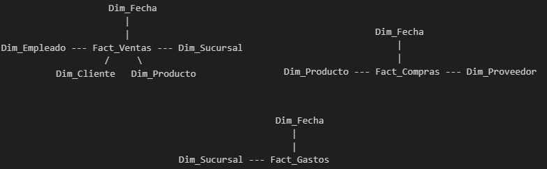 -->
  

  [Link Imagen](https://i.ibb.co/3nTVbWx/diagrama-esquema-en-estrella.png)
</p>

> [!TIP]    
> Puede aprender más sobre el Enterprise Data Warehouse Bus Matrix y Enterprise Data Warehouse Bus Architecture en mi proyecto "Enterprise Data Warehouse: Implementación de Arquitecturas CIF, Kimball & Data Vault 2.0".    
> En el mismo se profundiza sobre las distintas arquitecturas y formas de modelado para almacenes de datos.   
> Las arquitecturas tocadas son Corporate Information Factory (CIF), Multi Dimensional y Data Vault (2.0).   
> Por ende hablaremos, diseñaremos e implementaremos las misma a través de los modelados correspondiente como: normalizados (a través de las distintas formas normales), dimensional y data vault.   
> Cada arquitectura seguirá el enfoque de su creador teniendo en cuenta los patrones y antipatrones de diseños, sus casos de usos, ventajas y desventajas, costos, entre otros detalles de interés.   
> También se veŕa las distintas formas de gestión de cambio y de metadatos en cada arquitectura.    

## **Área de Preparación: Proceso de Carga y Transformación**
Una vez que los datos llegan a las tablas temporales en SQL Server, se ejecutan una serie de procesos para preparar los datos:

1. **Limpieza de Errores**: Revisión de los errores que quedaron sin resolver en la capa python y normalización de valores cuando sea posible.
2. **Unificación de Valores**:    
   Se unifican los datos de las tablas tipo_{nombre} con la correspondiente tabla de dimensión asociada.     
   Por ejemplo tmp_tipo_producto será absorbida por tmp_producto.
3. **Detección y Tratamiento de Outliers**: Identificación de valores atípicos en precios y cantidades, y ajuste del campo Compra_Total para reflejar datos precisos.
4. **Transformaciones Específicas**: Cálculo del tiempo de entrega para ventas y otros valores derivados importantes para el análisis.
5. **Agregación de Feriado**: Se agrega si una fecha era feriado o no.
6. **Actualización de IDs incorrectos**: Se actualizan aquellos IDs incorrectos por su valor correspondiente (por ejemplo en casos de duplicados no directos).

Esto se realiza con el archivo "./data_services/mssql/scripts/SQL/5_Transformacion_Datos_tablas_temporales.sql" a través de consultas de actualización y uso de procedimientos almacenados.

Las tablas temporales son:
1. **tmp_tipo_producto**
2. **tmp_producto**
3. **tmp_canal_venta**
4. **tmp_tipo_gasto**
5. **tmp_proveedor**
6. **tmp_sucursal**
7. **tmp_cliente**
8. **tmp_empleado**
9. **tmp_gasto**
10. **tmp_compra**
11. **tmp_venta**

### **Modelo Dimensional: Carga**

Una vez que los datos se han limpiado y transformado en el área de preparación, se cargan en el modelo dimensional de SQL Server.   
Esto permite a la empresa realizar análisis complejos sobre ventas, compras y gastos.        
Re que también se tiene un control de cambios en las dimensiones gracias al uso de Slowly Changing Dimensions (SCD) de tipo 2.       
Dado que SQL Server utiliza un control más estricto de las referencias se utilizará una clave subrogada auto incremental (con el nombre {nombre_dim}SK, por ejemplo: ClienteSK) como clave primaria en vez de una clave compuesta del tipo (Id{nombre_tabla}, Alta) para identificar cada registro de forma única en cada dimensión.

Primero se cargan las tablas de dimensiones:
- **Fecha**: Se hace UNION ALL a todas las tablas temporales que utilizan fechas y luego se carga utilizando DISTINCT (se verifica que no exista en dim_fecha previamente para cargas posteriores).
- **Producto**
- **Proveedor**
- **Sucursal**
- **Cliente**
- **Empleado**  

Y por último se cargan las tablas de hechos:  
- **Gastos**
- **Compras**
- **Ventas**

> [!NOTE]
>   1. Las cargas verifican que no existan previamente la misma información ya cargado en la tabla de dimensión objetivo.
>   2. Los ID a cargar como ID Principal serán siempre los correspondiente a Id{nombre_tabla}_Correcto, los mismos son filtrados por una cláusula WHERE con la condición Id{nombre_tabla} = Id{nombre_tabla}_Correcto. Evitando así aquellos registros que son duplicados no directos.
>   3. Se utiliza la hora del sistema para la columna "Alta", el valor "9999-12-31 23:59:59" para la columna "Baja" y el valor 1 para la columna "Version_Actual" necesarios para el SCD de tipo 2 permitiendo filtrar por la última versión siempre que sea necesario. Cuando se inserte un nuevo dato para un ID ya existente se cambiará el valor del campo "Baja" por la hora actual del sistema al momento del cambio y la columna Version_Actual a 0.  


<!-- <p align="center"> 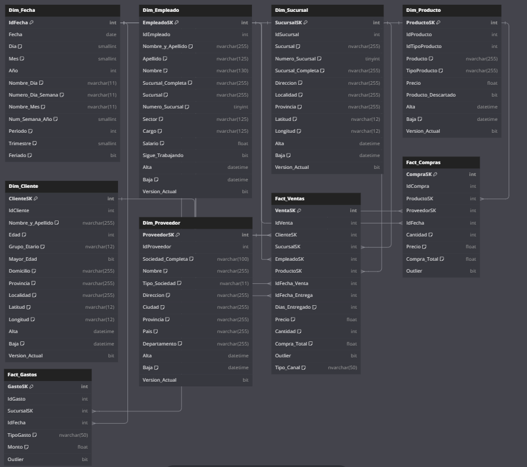 </p> -->
<p align="center">  </p>

[Link Imagen](https://i.ibb.co/xq5bQ64Q/diagrama-tablas-dbml-oscro.png)
<p align="center"><em>Diagrama de las tablas realizado en dbdiagram.io/d utilizando el Lenguaje DBML.</em></p>


## **Capa De Visualización** 
La última capa que toca explicar es la de visualización.     
La misma contiene el servicio Apache Superset y su metadata.   

Apache Superset es una plataforma moderna de código abierto para visualización de datos y business intelligence (BI).    
Fue diseñada para ser intuitiva, escalable y altamente interactiva, permite a los usuarios explorar, analizar y visualizar grandes volúmenes de datos mediante dashboards interactivos y gráficos avanzados.      
Fue creado por Maxime Beauchemin mientras trabajaba en Airbnb.     
Su objetivo era desarrollar una herramienta de BI que combinara facilidad de uso con capacidades avanzadas de visualización.    
Luego en 2017 Airbnb donó el proyecto a la fundación Apache convirtiéndo en un proyecto de código abierto bajo el nombre Apache Superset.

Al momento de crear el contenedor se realiza lo siguiente:
- Se instala Apache Superset 3.1.3
- Se descargar PyMSSQL para gestionar la conexión con el modelo dimensional
- Se inicia y configura la base de datos de metadatos.
- Se crea el usuario administrador.
- Se genera la conexión y se carga para estar "lista para usar".

Todo esto se realiza a través del DockerFile y el script "./data_services/superset/crear_db.sh".

> [!TIP]  
> Recuerde que puede ingresar a Apache Superset desde el navegador WEB: localhost:9000 o ip_local:9000

Para realizar análisis o dashboard deberá realizar los siguientes pasos:
- Ingresar a la WebUI. Recuerde que las credenciales son **superset** para usuario y contraseña.
- Hay distintas formas de realizar esta acción: Creando una Query y transformandola en Dataset o directamente crear un Dataset 
   - Dataset
      - Hacer clic en la esquina superior derecha en el símbolo "+", clic en "Data" y por último Dataset
      - En la parte izquierda de la pantalla elegír la base de datos "MSSQL_DIMENSIONAL", esquema "DBO" y la tabla de su interes.
      - Hacer clic en "CREATE DATASET" en la esquina inferior derecha.
      - Ahora puede iniciar el proceso de diseño.

   - SQL Lab
      - Hacer clic en la parte superior con la leyenda "SQL" y luego clic SQL Lab.
      - Escriba la Query que desee utilizar para crear un dashboard, chart, etc.
      - Una vez creada haga clic en "Save" para guardar la query con un nombre. Personalemente escribo QRY_nombre_de_la_query.
      - Luego puede crear el dataset haciendo clic en la parte derecha de "Save" (con símbolo de "flecha hacia abajo") y clic en "Save Dataset". Personalmente escribo DS_nombre_del_dataset.
      - Una vez guardado se le abrirá una nueva pestaña para iniciar el proceso de diseño.

> [!NOTE]  
> Si desea ir directamente a la URL para:      
> - Dataset: http://localhost:9000/sqllab/    
> - SQL Lab: http://localhost:9000/dataset/add/   

Con el mismo podemos crear algunas visualizaciones como por ejemplo:
<p align="center"><em>Comparativa entre ventas y gastos por sucursal. </em></p>
<!-- <p align="center"> 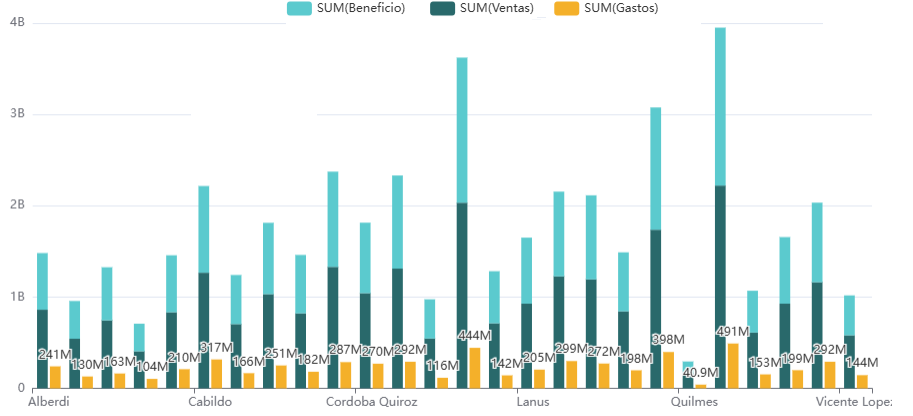 </p> -->
<p align="center">  </p>

[Link Imagen](https://i.ibb.co/FkMHGC8s/superset-mixed-chart-comparativa-ventas-Vs-gastos-por-sucursal.png)

<p align="center"><em>Top 10 Productos vendidos</em></p>
<!-- <p align="center"> 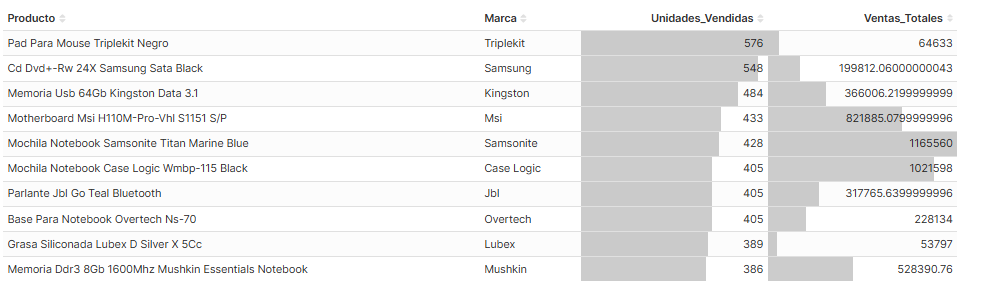 </p> -->
<p align="center">  </p>

[Link Imagen](https://i.ibb.co/RpfrTN7v/superset-tabla-top-10-productos-vendidos.png)

<p align="center"><em>Ventas Feriados vs No Feriados</em></p>
<!-- <p align="center"> 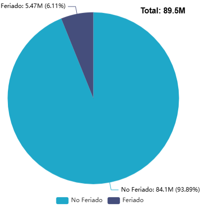 </p> -->
<p align="center">  </p>

[Link Imagen](https://i.ibb.co/rGTV3qTf/superset-pie-chart-ventas-feriados-vs-no-feriados.png)

<p align="center"><em>Ventas totales y Clientes únicos por Sucursal</em></p>
<!-- <p align="center"> 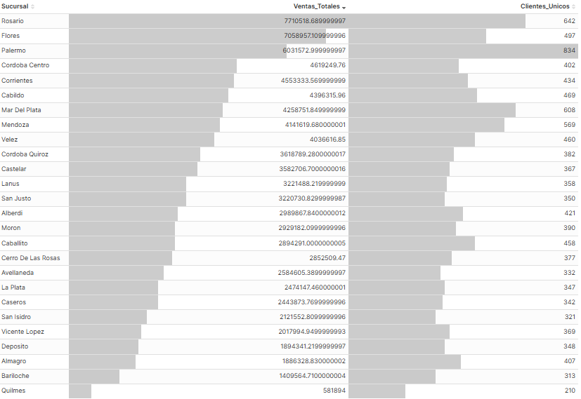 </p> -->
<p align="center">  </p>

[Link Imagen](https://i.ibb.co/6RXf5cbT/superset-tabla-ventas-totales-y-clientes-unicos-por-sucursal.png)


## **Ejecución Del Proyecto**
A continuación se deja un resumen del flujo de ejecución del proyecto.
1. Clonar el repositorio o descargarlo directamente en alguna carpeta (por ejemplo puede descargarlo en /home)
   ``` bash
      # Recomiendo cambiarle el nombre por uno más simple
      $ mv $DIR_PROYECTO_DESCARGADO /home/proyecto_etl_matias_alvarez

      # También recomiendo ejecutar el script "crear_carpetas_faltantes.sh" que se encuentra en la carpeta raíz
      # El mismo se encarga de verificar que existan las carpetas de interés que inicialmente están vacías
      # Si bien se utiliza .gitkeep para mantener la existencia de esas carpetas, algunas veces estas no se cargan al repositorio
      $ chmod +x crear_carpetas_faltantes.sh && ./crear_carpetas_faltantes.sh
   ```   
2. Crear un Entorno virtual con python 3.11
   ``` bash
      # Recuerde que debe estar en la carpeta del proyecto.
      # cd $DIR_PROYECTO
      $ python3 -m venv venv 

      # Iniciar entorno virtual
      $ source venv/bin/activate
      # Instalar los requerimientos de project_manager.py
      $ pip install -r project_manager/requirements.txt
   ```   

> [!TIP]   
> Recuerde verificar qué versión está utilizando con python3. Ejecute en la consola python3 --version.   
> Puede que dependiendo que intérprete tenga instalado deba utilizar algo como: python3.11 -m venv venv para instalar el entorno virtual.

3. Construir el proyecto a través del gestor.
   ``` bash
      # Se asume que se encuentra en la carpeta raíz del proyecto.
      $ python project_manager/project_manager.py construir-servicios
   ``` 
4. Iniciar todos los servicios.
   ``` bash
      $ python project_manager/project_manager.py iniciar-proyecto
   ``` 
5. Despausar los DAGs.
   ``` bash
      $ python project_manager/project_manager.py despausar-dags procesamiento_y_carga_all_dataset procesamiento_area_preparacion_y_carga_modelo_dimensional proceso_completo_del_proyecto 
   ``` 

6. Ejecutar el DAG maestro para procesar todo el proyecto.
   ``` bash
      $ python project_manager/project_manager.py procesar-dags proceso_completo_del_proyecto 
   ``` 

> [!NOTE]  
> Si desea realizar paso por paso la ejecución del proyecto en vez de ejecutar el DAG "proceso_completo_del_proyecto" ejecute en el siguiente orden:   
> (A) "procesamiento_y_carga_all_dataset"    
> (B) "procesamiento_area_preparacion"      
> (C) "carga_modelo_dimensional"      
> Si deseara ahorrarse realizar el paso B y C utilice el DAG "procesamiento_area_preparacion_y_carga_modelo_dimensional".   
>   
> Sea cual sea su decisión recuerde que debe estar despausado todos los DAGs a utilizar.  

7. Ver el estado del DAG ejecutado.
   ``` bash
      $ python project_manager/project_manager.py estado-de-dag proceso_completo_del_proyecto 
   ``` 

8. Eliminar el proyecto junto a sus volúmenes.
   ``` bash
      $ python project_manager/project_manager.py eliminar-servicios True
   ``` 

9. Salir del entorno virtual.
   ``` bash
      $ deactivate
   ``` 

Recuerde que si desea ingresar a las WebUI provista por algunos de los servicios debe realizar lo siguiente:    
   ``` bash
      # Obtener la IP local. En general debería poder utilizar localhost:puerto para acceder a la WebUI de cualquier servicio.
      # Pero dependiendo de cómo instale el proyecto (WSL, Maquina virtual) o como esté configurado su sistema puede que necesite ingresar como ip_local:puerto
      $ hostname -I | awk '{print $1}' 
   ``` 

Ahora puede ingresar a :
``` 
   + Apache Airflow: localhost:8080 o ip_local:8080
   + Apache Superset: localhost:9000 o ip_local:9000
``` 

## **Otros Proyectos**   
En esta sección encontrará los distintos proyecto que he realizado, puede ver el de su interés o aquellos que permiten solucionar alguna problematica de su empresa.   
Cada uno de ellos representan arquitecturas de referencia diseñadas específicamente para resolver problemáticas empresariales reales como: lentitud en procesos de datos, mala gobernanza o calidad de datos después de aplicar procesos de transformación, reporting inconsistente, infraestructuras frágiles y con falta de escalabilidad, problemas disponibilización de datos, patrones correctos de modelados, almacén de datos correcto para su caso de uso y su implementación, migración a entornos big data, etc.   

Cada desarrollo ofrece una solución completa (end-to-end), robusta y eficiente, implementada con tecnología de vanguardia y explicada en detalle desde el principio hasta el final.    
Encontrarás documentación exhaustiva que cubre la toma de decisiones, diseño arquitectónico, selección de tecnologías y proceso de implementación, complementada con fundamentos teóricos para facilitar su comprensión tanto para perfiles técnicos como de negocio.  
Puede utilizar la tabla de contenido para avanzar a las secciones de su interés y observar las imagenes de ejecución real del proyecto a medida que avanza en el.   

Todos los proyectos se resuelven de forma automatizada ya que incorporan un gestor CLI que automatiza completamente el despliegue, configuraciones, operaciones y cualquier otra necesidad.    
De esta forma con un solo comando cualquier usuario puede tener el sistema funcionando en minutos, sin necesidad de intervención manual o conocimiento técnico especializado, permitiendo evaluar la solución en condiciones reales de operación.

Recuerde que estas implementaciones no son solo demostraciones técnicas, sino propuestas prácticas y extrapolables que muestran diferentes enfoques para resolver desafíos complejos en entornos empresariales.

Le invito a explorar los repositorios para descubrir cómo estas soluciones pueden aplicarse en su contexto específico.   

Estos Proyectos son:

- **Enterprise Data Factory: ETL Automatizado Y Análisis Dimensional**     
   Enfocado a empresas de distribución multicanal con graves problemas de calidad de datos que le impiden la realización de análisis confiables, creando reporting inconsistente entre áreas, con realización de procesos ETL manuales propensos a errores que consumen días de procesamiento, y falta de visibilidad unificada del negocio para la toma de decisiones estratégicas.    
   Es la versión paralela de este proyecto pero utilizando otras tecnologías.   

   Se abordará una arquitectura frágil sin automatización, con fuentes de datos dispersas en formatos inconsistentes, duplicados críticos en registros maestros, falta de integridad referencial, y incapacidad para escalar procesamientos que realizan transformaciones manuales sin trazabilidad de errores que generaban desconfianza en los datos.       
   Se implementa una plataforma ETL industrializada que transforma los procesos manuales en flujos automatizados, reduciendo tiempos de procesamiento de días a minutos mediante grupos especializados en Apache NiFi con transformaciones multi-estrategia (ANSI SQL, Groovy, RecordPath y Expresiones REGEX).      
   Cada FlowFile es enriquecido con metadatos dinámicos que permiten enrutamiento automático y procesamiento contextual a través del lenguaje de expresión NiFi, permitiendo bifurcaciones condicionales y manejo granular de errores.        
   Se implementa controladores especializados para las conexiones JDBC optimizadas y la creación de esquema y serialización eficiente.      
   Los esquemas serán capas dinámica progresivas (Inicial, Intermedio, Final) que se adaptan a cada etapa de transformación manteniendo integridad de datos.     
   Cada transformación mantiene trazabilidad completa mediante columnas de error especializadas que permiten auditar el cambio de cada dato desde su origen hasta el modelo dimensional, facilitando la identificación de problemas upstream y la recuperación de falsos positivos.
   Se configura la infraestructura para procesamiento masivo sin pérdida de datos.    
   Se diseña e implementa un DW a través del modelado dimensional propuesto por Kimball con historización completa a través de SCD Tipo 2 mediante triggers automatizados y Enterprise Bus Matrix, logrando 92% de mejora en calidad de datos mediante normalización de formatos y gestión avanzada de duplicados (directos y no directos).   
   Toda esta información permite el BI self-service con Apache Superset, que ya estará configurado, con las credenciales y base de datos a consultar.   
   Sistema completamente autogestionado con gestor Bash que orquesta ciclo completo desde despliegue containerizado, la carga del template al canvas, configuración necesario para cada servicio, etc.  

   Tecnologías: Docker, Apache NiFi 1.27, SQL Server 2022, Apache Superset 3.1.3, Adminer 5.3.0, Bash 5.2.21.
   
- **Enterprise Data Warehouse: Implementación de Arquitecturas CIF, Kimball & Data Vault 2.0**      
   Enfocado para empresas que enfrentan desafíos críticos en la selección e implementación de su arquitectura de data warehouse: corporaciones que requieren una única fuente de la verdad pero no saben si invertir en un EDW normalizado, empresas en crecimiento que necesitan agilidad analítica sin comprometer escalabilidad, y organizaciones con entornos complejos que buscan máxima flexibilidad para integrar adquisiciones y cambios regulatorios.

   Se abordará la falta de criterios objetivos para seleccionar entre arquitecturas CIF, Multidimensional o Data Vault según contexto específico, el desconocimiento de trade-offs reales entre normalización, rendimiento y flexibilidad, y la dificultad para evaluar impactos en tiempo de implementación, costos de mantenimiento y complejidad técnica antes del despliegue.

   Dado estas problemáticas se implementa una plataforma comparativa que implementa tres arquitecturas completas de data warehouse sobre el mismo dataset empresarial, permitiendo evaluación real de cada enfoque:

   - Corporate Information Factory - CIF (Inmon) - Enfoque Corporativo:   
      Se diseña e implementa un EDW normalizado en 3NF/BCNF con +70 tablas que elimina 85% de redundancia a través de un modelo entidad-relación con integridad referencial estricta.   
      Se desarrollan Data Marts dependientes con modelado dimensional y estrategia SCD Tipo 2 para historización completa.    
      Ideal para corporaciones que priorizan consistencia y gobierno de datos como única fuente de la verdad.

   - Multidimensional (Kimball) - Enfoque Ágil:       
      Se construyen Data Marts independientes con esquemas estrella y copo de nieve optimizados para análisis.   
      Se implementa Enterprise Bus Matrix con dimensiones conformadas que permiten integración futura.   
      Enfoque Bottom-Up que reduce time-to-value de meses a semanas, perfecto para empresas medianas que buscan velocidad e insights rápidos.

   - Data Vault 2.0 - Enfoque Escalable:    
      Se implementa estructura Hubs-Links-Satellites con hash SHA256 unificado a través de +45 tablas especializadas.   
      Se modela capas RAW Vault para datos crudos y Business Vault para transformaciones con reglas de negocio.   
      Optimizado para entornos dinámicos con integraciones complejas, proporcionando trazabilidad 100% de cambios.

   Todos los DW consumiran un sistema fuente en MySQL con tablas transaccionales que simulan operaciones empresariales reales.   
   Se utilizará PostgreSQL para EDW normalizado y Data Vault, ClickHouse para Data Marts dimensionales.        
   Cada base de datos soportará la carga incremental a través de estrategía con Hash SHA256 calculado en base a sus atributos.   
   Se desplegará todos los servicios a través de docker utilizando el gestor Bash que orquesta y configura el despliegue multi-arquitectura.   

   Al final del proyecto se tendrán conocimientos de selección arquitectónica a través de la evaluación de 7 dimensiones: caso de uso, tamaño organizacional, presupuesto, equipo técnico, complejidad de fuentes, tiempo de implementación y flexibilidad requerida.   

   De esta forma se proporciona evidencia concreta y métricas reales para tomar decisiones de inversión en arquitectura de datos, demostrando capacidad para evaluar trade-offs complejos y alinear tecnología con objetivos estratégicos, reduciendo la incertidumbre en proyectos de data warehouse mediante comparativa empírica de enfoques.

   Tecnologías: Docker, MySQL 8.4.3, PostgreSQL 17.5, ClickHouse 25.6.2.5, Python, Bash 5.2.21, Adminer 5.3.0, DBeaver Cloud.   

- **Enterprise Streaming Platform - Arquitectura Kappa: Procesamiento En Tiempo Real Para Mu Online**       
   Enfocado para organizaciones que enfrentan desafíos críticos en la transformación de flujos masivos de datos operativos en inteligencia empresarial accionable en tiempo real.    
   Empresas que dependen de plataformas digitales y sistemas transaccionales sufren consecuencias directas por la incapacidad de procesar eventos en tiempo real como: pérdida de oportunidades de monetización por falta de personalización inmediata, experiencias de usuario subóptimas que impactan retención, toma de decisiones reactiva basada en datos históricos en lugar de insights actualizados, e ineficiencias operativas por arquitecturas batch tradicionales que introducen latencias de horas o días.    
   El status quo de procesamiento por lotes limita la capacidad de reaccionar a patrones emergentes y comportamientos críticos, mientras la falta de escalabilidad en sistemas monolíticos impide manejar picos de carga impredecibles, resultando en pérdida de datos valiosos y erosión de la ventaja competitiva.   

   La solución implementa una plataforma de streaming enterprise que redefine el procesamiento de eventos mediante arquitectura Kappa completa, transformando datos operativos en inteligencia empresarial sub-minuto.    
   El núcleo tecnológico integra un cluster Kafka 3.7.2 con protocolo KRaft que elimina la dependencia de ZooKeeper garantizando 99.95% de disponibilidad y throughput de +10K eventos/segundo y menos gasto de recursos y fallos de un solo punto al evitar ZooKeeper, Apache Spark 3.5.7 con Structured Streaming para procesamiento exactly-once con micro-lotes de 30 segundos, y Delta Lake 3.3.2 con transacciones ACID y time travel para análisis históricos.     
   Un simulador avanzado modela entidades complejas con coherencia fuerte a través de pseudo-ORM personalizado y sistema de caché LRU que reduce consultas a base de datos en 80%, mientras la arquitectura sigue el flujo completo desde generación de eventos hasta almacenamiento multi-capa con MongoDB para auditoría paralela.   

   La automatización integral abarca gestor Bash unificado con comandos para despliegue completo en 5 minutos, orquestación Docker con 8 servicios containerizados y health checks automáticos, sistema de logs asíncrono con reducción del 70% en impacto I/O, y checkpointing robusto para garantizar procesamiento exactly-once.     
   Las innovaciones en gestión de datos incluyen coherencia fuerte sin distributed transactions mediante patrón CQRS optimizado, cache warming predictivo  basado en patrones temporales (precarga la memoria caché con datos que se espera que se necesiten), schema evolution sin downtime para migración gradual en streaming, graceful degradation que mantiene funcionalidad crítica durante fallos parciales y graceful shutdown para apagado seguro.     

   Las capacidades de escalabilidad demuestran escalado horizontal ilimitado para picos de carga con distribución automática, tolerancia a fallos N-1 en cluster Kafka con replicación factor 3, procesamiento distribuido en cluster Spark, y almacenamiento multi-capa que separa operacional, RAW y procesado.     

   Tecnologías: Python 3.12, Apache Kafka 3.7.2 (KRaft), Apache Spark 3.5.7, Delta Lake 3.3.2, MongoDB 8.0.9, SQLite3, Docker 28.2.2, Bash 5.2.21, con componentes especializados de procesamiento (Structured Streaming, Micro-batches, Watermarks), almacenamiento (Delta Lake ACID, MongoDB Document Store), mensajería (Kafka KRaft Cluster, Exactly-Once Semantics), y dependencias críticas como Spark SQL Kafka 0.10, Delta Spark, y Kafka Clients.

- **Infraestructura Big Data: Cluster Hadoop & Estrategías De Migración Multi-Herramienta**     
   Enfocado para organizaciones con data warehouses tradicionales que enfrentan limitaciones críticas de escalabilidad cuando los volúmenes de datos superan la capacidad de sistemas relacionales convencionales.   
   La migración hacia entornos Big Data representa un desafío técnico complejo que consume meses de planificación y ejecución, con altos riesgos de interrupción operativa y pérdida de integridad de datos.   
   La falta de estrategias de migración probadas genera incertidumbre en la transición, mientras la carencia de interfaces unificadas limita el acceso a datos distribuidos para equipos de negocio.    
   La dependencia de soluciones propietarias incrementa costos de licenciamiento y reduce flexibilidad arquitectónica, afectando la capacidad de adaptación a nuevas fuentes de datos y casos de uso analítico.

   Se diseña e implementa una plataforma Big Data enterprise que migra data warehouse dimensional completo desde SQL Server hacia arquitectura distribuida mediante cluster Hadoop pseudo-distribuido implementado desde binarios oficiales.    
   La solución consolida +12 servicios especializados incluyendo Hadoop 3.4.1 con NameNode, 3 DataNodes, ResourceManager y NodeManager configurados con replicación triple y tolerancia a fallos N-1.    
   El data warehouse distribuido se implementa con Apache Hive 3.1.3 y metastore PostgreSQL 17.5, proporcionando capacidad SQL sobre datos en HDFS.    
   Se desarrollan 3 estrategias de migración optimizadas: Apache Sqoop para transferencia batch masiva mediante MapReduce logrando 5x mayor velocidad que ETL tradicional, Apache NiFi para orquestación visual con capacidades de streaming que reduce tiempo de desarrollo en 60%, y BCP para transferencias críticas de alto rendimiento.    
   La arquitectura incluye Apache Hue como interfaz unificada que permite a equipos de negocio realizar análisis de forma autónoma sin dependencia de especialistas técnicos.    
   La automatización completa con Docker reduce tiempos de despliegue en 80% mediante gestor Bash que gestiona todo el ciclo de vida desde construcción hasta migración, estableciendo base escalable para analytics a nivel petabyte con configuración de memoria optimizada (4GB Map, 8GB Reduce) y balanceador de cluster con threshold del 10%.

   Tecnologías: Apache Hadoop 3.4.1, Apache Hive 3.1.3, Apache Sqoop 1.4.7, Apache NiFi 1.27, Apache Hue 4.11.0, PostgreSQL 17.5, SQL Server 2022, Docker, Bash 5.2.21, pgAdmin 4.

- **Disponibilización De Datos - API de catálogo de contenido: EDA, canalización ETL y FastAPI con Redis**      
   Enfocado para aquellas organizaciones que manejan grandes volúmenes de datos distribuidos que enfrentan desafíos críticos en la disponibilización de información para la toma de decisiones.   
   Que pueden todavía tener procesos manuales de transformación que consumen tiempo y son propensos a errores, mientras la falta de una API unificada limita la integración con sistemas corporativos y la experiencia de usuario final.   
   La latencia en consultas impide análisis en tiempo real y reduce la capacidad de respuesta operativa, generando reporting inconsistente entre áreas y duplicación de esfuerzos en el procesamiento de datos.   
   Esta incapacidad para acceder a información confiable y actualizada impacta directamente en la ventaja competitiva y la eficiencia operacional.

   De esta forma se implementa una solución end-to-end que transforma datos crudos distribuidos en información estructurada y disponible mediante API REST de alto rendimiento con las mejores practicas.    
   La arquitectura orientada a servicios integra un pipeline ETL automatizado con Python y Pandas que procesa miles de registros aplicando reglas de calidad basadas en análisis exploratorio (EDA) comprehensivo, eliminando valores nulos, duplicados y redundancias mediante normalización de formatos y corrección de inconsistencias, logrando 85% de mejora en calidad de datos.    
   Se diseña e implementa modelo relacional avanzado en PostgreSQL con 15 tablas normalizadas que capturan relaciones complejas entre entidades sin redundancia.    
   La API FastAPI modular con +20 endpoints organizados en dominios funcionales implementa validación estricta con Pydantic, inyección de dependencias y documentación OpenAPI automática.    
   El sistema de caché Redis con políticas de expiración diferenciadas optimiza acceso a datos frecuentes, reduciendo latencia de segundos a milisegundos y mejorando rendimiento en 60% para consultas concurrentes.    
   La solución completa se containeriza con Docker y se automatiza mediante gestor Bash unificado que orquesta el ciclo completo desde transformación hasta despliegue, incluyendo sistema resiliente con reintentos automáticos y degradación elegante ante fallos de servicios dependientes.

   Tecnologías: Docker, Python 3.12, PostgreSQL 17, FastAPI, Redis, SQLAlchemy ORM, Uvicorn, Pydantic, FastAPI-Cache2, Pandas, PickleCoder, Bash 5.2

- **Sistemas de Replicación MySQL Enterprise: Alta Disponibilidad, Escritura y Automatización Avanzada**    
   Enfocado para organizaciones que dependen de bases de datos críticas que enfrentan desafíos operativos severos en gestión de alta disponibilidad y escalabilidad.   
   Las configuraciones manuales de replicación consumen horas de especialistas y son propensas a errores humanos que generan downtime costoso.   
   La falta de automatización en failover y recuperación ante desastres impacta directamente la continuidad del negocio, mientras la incapacidad para escalar dinámicamente limita el crecimiento y adaptación a demandas fluctuantes.   
   Sistemas legacy sin monitoreo unificado imposibilitan la detección temprana de problemas, generando pérdidas financieras por interrupciones no planificadas y afectando la experiencia del usuario final.   

   Se diseña e implementa una plataforma enterprise de replicación MySQL que redefine la gestión de bases de datos distribuidas mediante automatización integral.   
   La misma implementa 4 arquitecturas avanzadas (Maestro-Esclavo, Maestro-Maestro, Circular, Grupo) con capacidades de failover automático en menos de 30 segundos y sistema de versionado con snapshots para rollback inmediato, también permite configurar el nivel de sincronización.       
   La solución combina scripts Bash que reducen despliegues de horas a segundos y eliminan 90% de errores de configuración manual, con framework Python especializado que aplica patrones Singleton y Observer para validación de consistencia transaccional entre nodos.   
   La arquitectura diferenciadora incluye sistema de gestión de ciclo de vida completo que automatiza configuración, operación y mantenimiento de clusters, escalado dinámico de 1 a 9 nodos con distribución inteligente de carga y tolerancia a fallos N-1, stack de monitoreo enterprise con Prometheus, Grafana y cAdvisor que reduce detección de problemas en 70% mediante métricas en tiempo real, implementación de replicación por grupo con algoritmos de consenso para alta disponibilidad automática, e integración MySQL Router con AdminAPI e InnoDB Cluster para enrutamiento inteligente de conexiones.   
   Los procesos de automatización clave abarcan configuración automática de métodos de replicación (Bin-Log y GTID) según topología, bootstrapping inteligente que adapta procedimientos por tipo de nodo y modelo, sistema de backups versionado con gestión de estados y recuperación granular, y framework de testing que valida consistencia transaccional y detecta inconsistencias pre-producción.    
   Métricas de impacto cuantificables: 90% reducción en errores de configuración, failover automático en menos de 30 segundos, 99.95% uptime, 40% mejora en rendimiento de escritura, 70% reducción en tiempo de detección de problemas.

   Tecnologías: MySQL 8.4.3 (Server, Router, Shell, AdminAPI), Docker, Python 3.10-3.12, Bash 5.1.16, Prometheus 3.2.0, Grafana 11.5.2, cAdvisor 0.49.1, SQLAlchemy, MySQL-Connector-Python, Docker-Compose

> [!TIP]   
> Si tienes alguna duda o quieres hacer networking puedes agregarme:  

> - [**Linkedin**](https://www.linkedin.com/in/matias-alvarez-g/)   

